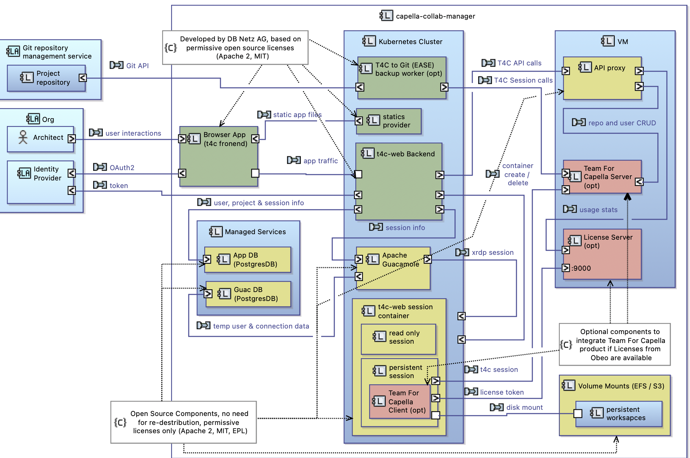

# Contributing

Thanks for your interest in our project. Contributions are always welcome!

We are committed to fostering a welcoming, respectful, and harassment-free
environment. Be kind!

If you have questions, ideas or want to report a bug, feel free to [open an
issue](/../../issues). Or go ahead and [open a pull request](/../../pulls) to contribute
code. In order to reduce the burden on our maintainers, please make sure that
your code follows our style guidelines outlined below.

## General

This project consists of several services. Here is the architecture of the services:


To get an overview of the services, it is also worth taking a look at the Helm Chart,
which can be found in the `helm` folder.

We use REST APIs for the communication between frontend and backend.
Please follow the [RESTful web API design best practises](https://docs.microsoft.com/en-us/azure/architecture/best-practices/api-design).

We recommend to get started with the [local k8d deployment](README.md).

## Capella Docker images

Please follow the [README of the Capella Docker images repository](/../../../capella-dockerimages/blob/main/README.md).
When all files are in the right place, you can execute the following command to build
and push the Docker images.

```sh
make capella-dockerimages
```

## OAuth Server

We use OAuth2 as authentication protocol for our application. Therefore we need an
OAuth2 server. For local development, we have an OAuth mock that needs to be started
first.

First of all, navigate to the `mocks/oauth` directory.

You can handle the SSL-support in two different ways:

### Option 1: Use insecure connections

This is the default and recommended option for local development.
Do not use it in production!

1. Run the OAuth2-Mock-Server with:

   ```sh
   make start
   ```

2. Verify that the server runs, e.g. by navigating to
   [Well Known](http://localhost:8083/default/.well-known/openid-configuration)

### Option 2: Create a self signed certificate

1. We require the files `projectroot/certs/localhost.cert` and `projectroot/certs/localhost.p12`.
   You can easily create them with

   ```sh
   make ssl
   ```

2. Import the certificate to your local certificate store.
3. Run the OAuth2-Mock-Server with:

   ```sh
   make start-ssl
   ```

4. Verify that the server runs, e.g. by navigating to
   [Well Known](https://localhost:8083/default/.well-known/openid-configuration)

## t4cserver

1. Navigate to `mocks/t4cserver/`.
1. Setup a local python environment
  ```sh
  python3 -m venv .venv
  source.venv/bin/activate
  pip install -U pip setuptools
  pip install -e '.[options]'

1. Launch the server :
  The port must match the key modelsources.t4c.usageAPI in the backend
  config. Change it to 7000 for example.
  ```sh
  source .venv/bin/activate # if not sourced before
  uvicorn mock:app --host 0.0.0.0 --port 7000 --reload
  ```

## Backend

Requirements:

- `python` and `pip`
- `docker`
- `make`

Run the following steps:

1. In the project's root directory you must create a local k3d cluster by running

   ```sh
   make create-cluster
   ```

1. In order to use Guacamole, the cluster must be deployed :
  ```sh
  make deploy
  ```

1. Navigate to the `backend` directory of your cloned repository.
1. We recommend that you develop inside of a virtual environment. To set it up,
   run the following commands:

  ```sh
  python3 -m venv .venv
  source .venv/bin/activate
  pip install -U pip setuptools
  pip install -e '.[dev]'
  ```

1. The backend uses various configuration settings. You can find them in the `config`
   directory.
   Please copy the file `config_template.yaml` to `config.yaml` and adjust the values.

   *Hint*: If you already have the k8d cluster running and the if you have the
   application deployed, then no configuration values need to be adjusted.

   *Hint*: You can run `python -m t4cclient.config.diff` after each update to check if your config is up to date.

1. This step is only **necessary, if you use the self signed certificate** option for the oauth mock.

   If you don't have the certificate in your local certificate store, please execute the following command:

   ```sh
   export REQUESTS_CA_BUNDLE=$(pwd)/../certs/localhost.crt
   ```

   You need to adjust the option `authentication.oauth.endpoints.wellKnown` in the `config.yaml` to the following value:

   ```text
   https://localhost:8083/default/.well-known/openid-configuration
   ```

1. To begin the development a PostgreSQL database is required. To run the database and
   start the backend run:

   ```sh
   make dev
   ```

1. You should see it running on port 8000.

   - [Healthcheck](http://localhost:8000/healthcheck)
   - [Documentation](http://localhost:8000/docs)

We additionally recommend that you set up your editor / IDE as follows.

- Indent with 4 spaces per level of indentation
- Maximum line length of 79 (add a ruler / thin line / highlighting / ...)
- Set up the editor to run `black`, `pylint`, `mypy` and `isort` when saving.

### Create database migrations scripts

To create an upgrade script automatically (this will compare the current database state
with the models):

```sh
cd t4cclient
alembic revision --autogenerate -m "Commit message"
```

## Authentication without application frontend

Request the `auth_url`

```sh
curl -X 'GET' \
  'http://127.0.0.1:8000/api/v1/authentication/' \
  -H 'accept: application/json'
```

Opening the `auth_url` in a browser leads you to a "Mock OAuth2 Server Sign-in" page.

Login as user `admin` to be redirected to a page that is reachable when the frontend
runs. Anyway the redirect URL in the browser's address input field contains two
parameters `code` and `status`.

Example:

<pre>
    http://localhost:4200/oauth2/callback?...
    ...code=<span style="color:green">MREy4raZT9JqaYn_50yJraU4zkclGQbNcbudW404ekc</span>...
    ...&state=<span style="color:green">r7huaqqdDBWTb8x4gUDIpt36izM0Au</span>
</pre>

One must copy these parameters and post them via a second request returning an access
token:

```sh
curl -X 'POST' \
  'http://127.0.0.1:8000/api/v1/authentication/tokens' \
  -H 'accept: application/json' \
  -H 'Content-Type: application/json' \
  -d '{
  "code": "MREy4raZT9JqaYn_50yJraU4zkclGQbNcbudW404ekc",
  "state": "r7huaqqdDBWTb8x4gUDIpt36izM0Au"
}'
```

To send a request using that token you may want to request the list of projects:

```sh
curl -X 'GET' \
  'http://127.0.0.1:8000/api/v1/projects/' \
  -H 'accept: application/json' \
  -H 'Authorization: Bearer <TOKEN>'
```

whereby `<TOKEN>` must be replaced by the token you received above.

Using the Swagger UI one can click on the lock symbols to enter the access token.

## Frontend

Requirements:

- Node.js 16 or 17
- `npm` package manager
- [Angular CLI](https://angular.io/cli#installing-angular-cli)
- `make`

Run the following steps:

1. Navigate to the `frontend` folder
1. Install dependencies via `npm install`
1. Optional: If you like to use your custom favicon, please copy it to `src/favicon.ico`
1. Optional: If you like to use your custom theme, replace the file `src/custom-theme.scss`.
   You can generate custom themes [here](http://mcg.mbitson.com/)
1. Copy the file `src/environment.ts` to `src/environment.dev.ts` and adjust the values.
1. Run the frontend with:

   ```sh
   make dev
   ```

1. You should see the frontend running von port 4200.

We additionally recommend that you set up your editor / IDE as follows.

- Set up the editor to run [prettier](https://prettier.io/) when saving.

## Code style for the Python backend

We base our code style on a modified version of the [Google style guide for
Python code](https://google.github.io/styleguide/pyguide.html). The key
differences are:

- **Docstrings**: The [Numpy style
  guide](https://numpydoc.readthedocs.io/en/latest/format.html) applies here.
- **Linting**: Use [pylint](https://github.com/PyCQA/pylint) for static code
  analysis, and [mypy](https://github.com/python/mypy) for static type
  checking.
- **Formatting**: Use [black](https://github.com/psf/black) as code
  auto-formatter.

  Be aware of the different line length of 72 for docstrings. We currently do
  not have a satisfactory solution to automatically apply or enforce this.

  Note that, while you're encouraged to do so in general, it is not a hard
  requirement to break up long strings into smaller parts. Additionally, never
  break up strings that are presented to the user in e.g. log messages, as that
  makes it significantly harder to grep for them.

  Use [isort](https://github.com/PyCQA/isort) for automatic sorting of imports.
  Its settings should automatically be picked up from the `pyproject.toml` file
  as well.
- **Typing**: We do not make an exception for `typing` imports. Instead of
  writing `from typing import SomeName`, use `import typing as t` and access
  typing related classes like `t.TypedDict`.

  Use the new syntax and classes for typing introduced with Python 3.10 and
  available using `from __future__ import annotations` since Python 3.8. Be
  aware however that this only works in the context of annotations; the code
  still needs to run on Python 3.8! This means that in some (rare) cases, you
  *must* use the old-style type hints.

  - Instead of `t.Tuple`, `t.List` etc. use the builtin classes `tuple`, `list`
    etc.
  - For classes that are not builtin (e.g. `Iterable`), `import collections.abc
    as cabc` and then use them like `cabc.Iterable`.
  - Use [PEP-604](https://www.python.org/dev/peps/pep-0604/)-style unions, e.g.
    `int | float` instead of `t.Union[int, float]`.
  - Use `... | None` (with `None` always as the last union member) instead of
    `t.Optional[...]` and always explicitly annotate where `None` is possible.
- **Python style rules**: For conflicting parts, the [Black code
  style](https://black.readthedocs.io/en/stable/the_black_code_style/current_style.html)
  wins. If you have set up `black` correctly, you don't need to worry about
  this though :)
- When working with `dict`s, consider using `t.TypedDict` instead of a more
  generic `dict[str, float|int|str]`-like annotation where possible, as the
  latter is much less precise (often requiring additional `assert`s or
  `isinstance` checks to pass) and can grow unwieldy very quickly.
- Prefer `t.NamedTuple` over `collections.namedtuple`, because the former uses
  a more convenient `class ...:` syntax and also supports type annotations.
