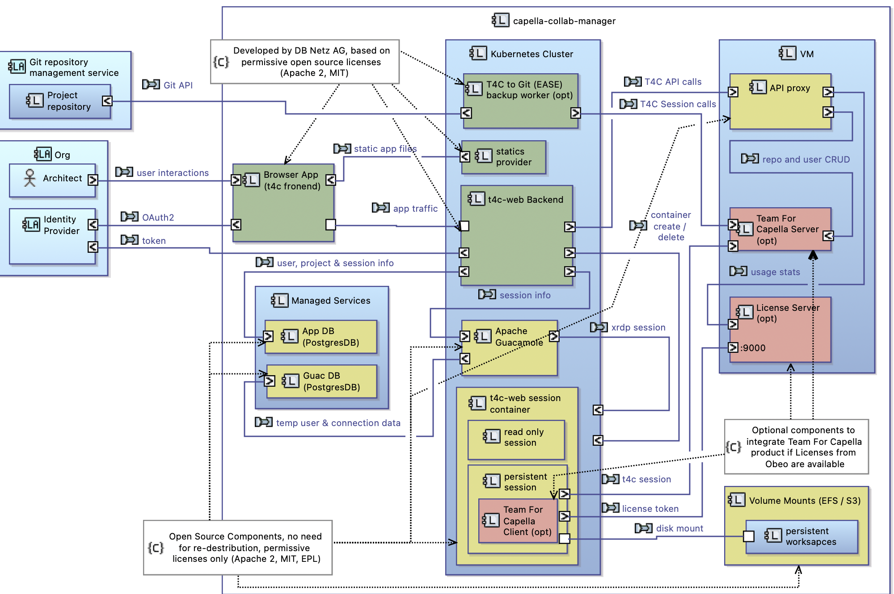

<!--
 ~ SPDX-FileCopyrightText: Copyright DB Netz AG and the capella-collab-manager contributors
 ~ SPDX-License-Identifier: Apache-2.0
 -->

# Capella Collaboration Manager


A web platform for collaboration on [Capella](https://www.eclipse.org/capella/)
(MBSE) projects

**Copyright 2021, 2022 [DB Netz AG](https://fahrweg.dbnetze.com/),
licensed under Apache 2.0 License (see full text [here](./LICENSES/Apache-2.0.txt))**

Turn your local Capella experience into a browser-based collaboration platform for
model-based projects. Designed to enable co-working across multiple organizations.
Here are some of the key features:

- Run Capella in a browser
- Supports both git and [Team for Capella](https://www.obeosoft.com/en/team-for-capella)
  co-working models
- Single sign on (SSO) via [OAuth2](https://oauth.net/2/)
- No need to install or maintain local Capella clients - clients are made on demand in
  an underlaying [Kubernetes](https://kubernetes.io/) cluster
- Access to projects and models is self-managed by project leads, model owners or
  delegates
- Within a project a user could have read or read/ write access. Read-only users don't
  consume licenses in Team for Capella projects
- Integration with git repository management for backup and workflow automation around
  the models

We have more exciting features on our roadmap, for instance:

- an integration of templates
- a planning and release management for model-derived artifacts like documents,
  interface definitions, spreadsheets, etc.

## Getting started

### Running locally with k3d

#### Prerequisites

To deploy the application you need:

- [Docker](https://docs.docker.com/engine/install/ubuntu/) >= 20.10.X
- [kubectl](https://kubernetes.io/docs/tasks/tools/install-kubectl-linux/) >= 1.24 (Stargazer)
- [helm](https://helm.sh/docs/intro/install/) >= 3.X.X
- [Make](https://www.gnu.org/software/make/manual/make.html) >= 3.82, better 4.X

If you'd like to run it locally, these tools are additionally required:

- [k3d](https://k3d.io/) - a lightweight k8s cluster simulator
- `nss-myhostname` to access local container registry
  (on Ubuntu you can get it via `sudo apt install libnss-myhostname`)

When you have all that installed you can do the following:

```zsh
git clone --recurse-submodules https://github.com/DSD-DBS/capella-collab-manager.git
cd capella-collab-manager

# Create a local k3d cluster
make create-cluster

# Deploy the application (choose one of the two options)
# WITHOUT TeamForCapella session support
make deploy

# WITH TeamForCapella session support
make deploy-t4c
```

It can take a long time to run, but shouldn't take more than 5 minutes.
Please wait until all services are in the "Running" state.

If all goes well, you should find Capella-collab-manager running on [http://localhost:8080/](http://localhost:8080/).

To reduce the build time, the default configutation only builds a Capella 5.2.0 image. You can modify the `Makefile`
if you want to build multiple versions.
By default the TeamForCapella images are configured. You can change those in the Settings section of the website.

If you want to see the individual services in the Kubernetes dashboard, you can run the following command:

```zsh
make dashboard
```

If something goes wrong, please open an issue on Github.

To clean up the environment run:

```zsh
make delete-cluster
```

#### Starting a session

Once the cluster is installed and all services are running (`kubectl get pods`), you can
get started. Follow our [Getting started guide](docs/getting_started/getting_started.md) and be up and
running in a few minutes.

### Deployment

### Install on a cluster

1. Ensure your `kubectl` configuration points to the right cluster
2. Copy `helm/values.yaml` to `deployments/yourinstance.values.yaml`
3. Set all required values in the `deployments/yourinstance.values.yaml` configuration file
4. Create your sessions namespace in your kubernetes cluster:

   ```sh
   kubectl create namespace <your-namespace>
   ```

5. Run the following command to deploy to your kubernetes cluster:

   ```sh
   helm install production -n <namespace> -f deployments/yourinstance.values.yaml helm
   ```

6. Set up the database for guacamole: [Initializing the PostgreSQL database](https://guacamole.apache.org/doc/gug/guacamole-docker.html#initializing-the-postgresql-database)

### Upgrade an cluster instance

1. Ensure your `kubectl` configuration points to the right cluster
2. Compare `helm/values.yaml` with your `deployments/yourinstance.values.yaml` and update your configuration accordingly.
3. Run the following command to deploy to your kubernetes cluster:

   ```sh
   helm upgrade production -n <namespace> -f deployments/yourinstance.values.yaml helm
   ```

### Team for Capella integration

For environments where TeamForCapella (commercial product of Obeo) is available it is possible to integrate such service with this management app. The integration requires the TeamForCapella backend to have the REST API feature enabled (in 5.0 it was still experimental). The TeamForCapella client then gets "baked" into the t4c-remote session image, however without the license secret. License secret is injected into container at runtime. Additionally, monitoring of available / consumed licenses is available but reqires the license server to be run with monitoring feature enabled.

## How it works



The Capella Collaboration Manager consists of a couple of components:

- A frontend - what you see in the browser
- A backend web service - for managing users and sessions
- [Guacamole](https://guacamole.apache.org/), to expose the sessions via the browser
- Databases, for state persistence.
- Optional: A Teams4Capella server

Sessions are created in a separate namespace.

## Contributing

We'd love to see your bug reports and improvement suggestions! Please take a look at
[guidelines for contributors](CONTRIBUTING.md).
You'll also find instructions on how to set up a local development environment.
