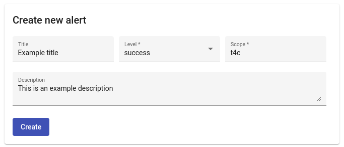
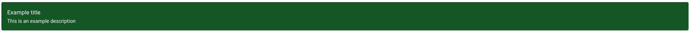

<!--
 ~ SPDX-FileCopyrightText: Copyright DB InfraGO AG and contributors
 ~ SPDX-License-Identifier: Apache-2.0
 -->

Alerts can be used to inform users about changes, news or maintenance work. The
alerts are displayed to each user.

1.  Navigate to `Menu` → `Settings`
2.  Fill in all required fields in the `Create an alert` form.
    

    !!! Question "What does the alert level mean?"

        The alert level specifies
        the background color of the alert. You can choose one of the following
        options: <br>

        :material-checkbox-blank-circle:{ style="color: #004085 " } `primary` <br>
        :material-checkbox-blank-circle:{ style="color: #383d41 " } `secondary` <br>
        :material-checkbox-blank-circle:{ style="color: #155724 " } `success` <br>
        :material-checkbox-blank-circle:{ style="color: #721c24 " } `danger` <br>
        :material-checkbox-blank-circle:{ style="color: #fff3cd " } `warning` <br>
        :material-checkbox-blank-circle:{ style="color: #d1ecf1 " } `info` <br>

    !!! Question "Which scopes are available?"

        Currently, there is only one scope.
        Please enter `t4c` in the scope field.

    !!! hint

        Simple HTML tags can be used in the alerts description. For
        example, a link can be created with:

        ``` html
        <a href="example.com">Link description</a>
        ```

3.  The alert is now created and is displayed to all users:
    
