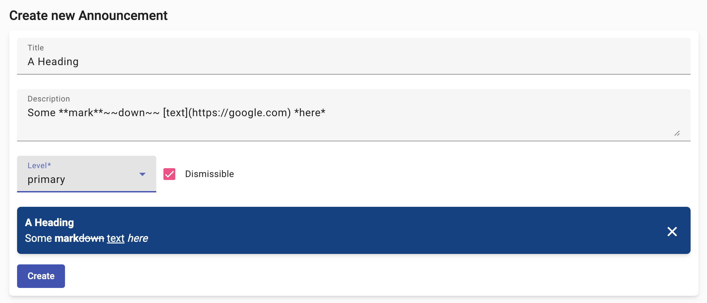
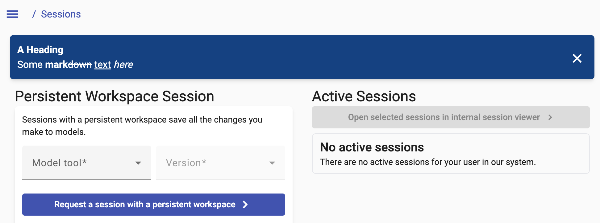

<!--
 ~ SPDX-FileCopyrightText: Copyright DB InfraGO AG and contributors
 ~ SPDX-License-Identifier: Apache-2.0
 -->

Announcements can be used to inform users about changes, news or maintenance
work. Announcements are displayed to all users, no matter their role.

1.  Navigate to `Menu` → `Settings`
2.  Fill in all required fields in the `Create new announcement` form.
    

    !!! Question "What does the announcement level mean?"

        The announcement level specifies
        the background color of the announcement. You can choose one of the following
        options: <br>

        :material-checkbox-blank-circle:{ style="color: #004085 " } `primary` <br>
        :material-checkbox-blank-circle:{ style="color: #383d41 " } `secondary` <br>
        :material-checkbox-blank-circle:{ style="color: #155724 " } `success` <br>
        :material-checkbox-blank-circle:{ style="color: #721c24 " } `danger` <br>
        :material-checkbox-blank-circle:{ style="color: #fff3cd " } `warning` <br>
        :material-checkbox-blank-circle:{ style="color: #d1ecf1 " } `info` <br>

    !!! hint

        The announcement description supports markdown syntax.

        ```markdown
        You can use __bold__, *italic*, ~~strikethrough~~, and `code` text.
        ```
        Check the [Markdown Guide](https://www.markdownguide.org/basic-syntax/) for more information.

        Additionally, you can use HTML tags in the announcement description.

    !!! hint

        By default, announcements can be dismissed by users. If you want to create an announcement that cannot be dismissed, you can toggle the `Dismissible` checkbox.

3.  The announcement is now created and is displayed to all users:
    
