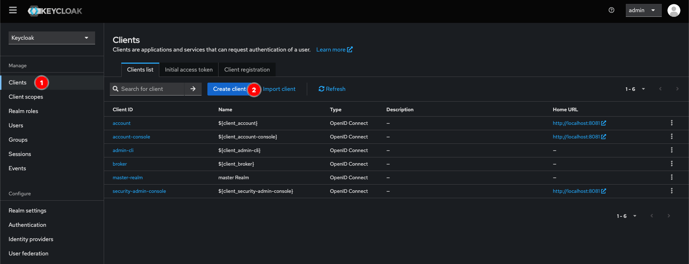
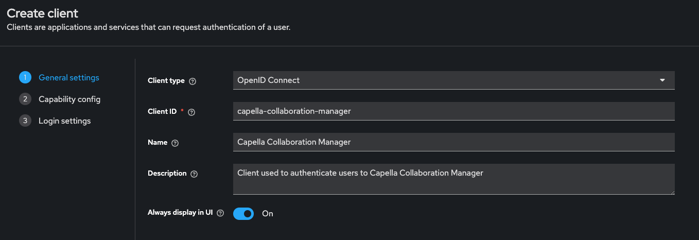
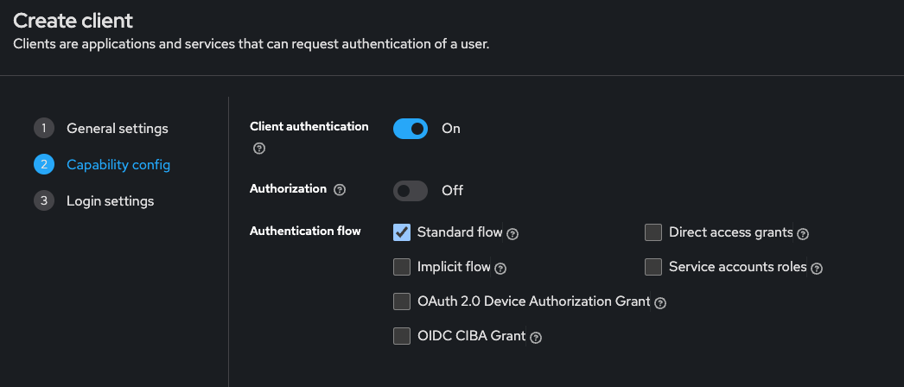
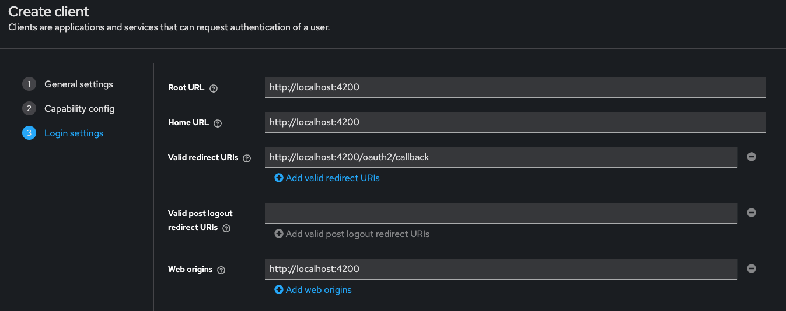
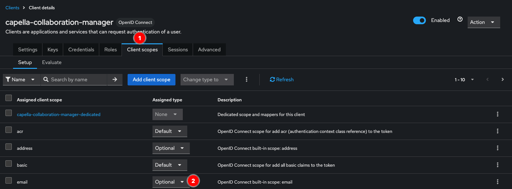

<!--
 ~ SPDX-FileCopyrightText: Copyright DB InfraGO AG and contributors
 ~ SPDX-License-Identifier: Apache-2.0
 -->

# Keycloak as Identity Provider

This guide will help you set up [Keycloak](https://www.keycloak.org/) as an
identity provider for the _Capella Collaboration Manager (CCM)_. It focuses on
setting up the connection between Keycloak and CCM. The setup of the connection
between Keycloak and your identity provider is not covered.

## Install Keycloak

If you don't already have a running Keycloak server, please follow the
installation instructions in
[Keycloak - Getting Started](https://www.keycloak.org/guides#getting-started).

After this step, you should have access to the Keycloak admin console, which is
required for the following steps.

## Register the CCM Client in Keycloak

1.  Below **Manage** click on **Clients** and then **Create client**: <br>
    
1.  In **General settings** set the values as follows:

    | Key                     | Value                                                                  |
    | ----------------------- | ---------------------------------------------------------------------- |
    | **Client type**         | OpenID Connect                                                         |
    | **Client ID**           | capella-collaboration-manager                                          |
    | **Name**                | Capella Collaboration Manager                                          |
    | **Description**         | Client used to authenticate users in the Capella Collaboration Manager |
    | **Allow display in UI** | Personal preference                                                    |

    

1.  In **Capability config** modify the the default values as follows:

    1. Enable **Client Authentication**
    1. Disable **Direct access grants**

    

1.  In **Login settings** set the values as follows:

    | Key                                                     | Value                                                     | Example value <br> (development environment) |
    | ------------------------------------------------------- | --------------------------------------------------------- | -------------------------------------------- |
    | **Root URL** + <br> **Home URL** + <br> **Web origins** | `{scheme}://{host}:{port}` <br> (URL of the CCM frontend) | `http://localhost:4200`                      |
    | **Valid redirect URIs**                                 | `{scheme}://{host}:{port}/oauth2/callback`                | `http://localhost:4200/oauth2/callback`      |
    | **Valid post logout redirect URIs**                     | None                                                      | -                                            |

    

1.  Click **Save**, which should create the client in Keycloak.
1.  Make the email claim optional. It is not required for the CCM.

    1.  In the Clients tab, open the client details of the newly created client
    1.  Click on **Client scopes**
    1.  For the _email_ scope, change the **Assigned Type** from _Default_ to
        **Optional**

    

## Configure the CCM to use the Keycloak Client

Update the `values.yaml` and set the following values for the
`backend.authentication` section:

```yaml
backend:
  authentication:
    endpoints:
      wellKnown: [...]/.well-known/openid-configuration # (1)!

    audience: default

    claimMapping: # (2)!
      idpIdentifier: sub
      username: preferred_username
      email: email

    scopes:
      - openid
      - profile
      - offline_access

    client:
      id: capella-collaboration-manager # (3)!
      secret: ... # (4)!

    redirectURI: [...]/oauth2/callback # (5)!
```

1. To find out the well-known endpoint, click _Realm Settings_ in Keycloak,
   scroll down and click _OpenID Endpoint Configuration_, which should open the
   configuration in a new tab. The well-known endpoint is the URL of the opened
   page.
2. Make sure that the mentioned claims are available in the identity token. You
   can evaluate the claims available in the token via Keycloak: Open the client
   details, click on the _Client scopes_ tab and navigate to "Evaluate".
3. Set the _client.id_ to the value used when the client was created. If not
   changed it should be _capella-collaboration-manager_.
4. To find out the client secret, open the client details in the Keycloak admin
   console. Open the _Credentials_ tab and copy the _Client Secret_. Keep this
   value confidential and generate a new client secret in case it gets leaked.
5. Set the _redirectURI_ to the CCM base url + _/oauth2/callback_

Then redeploy the application using Helm.
