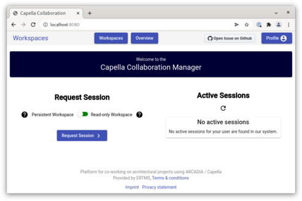
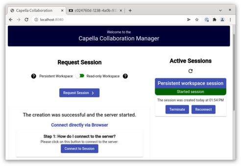
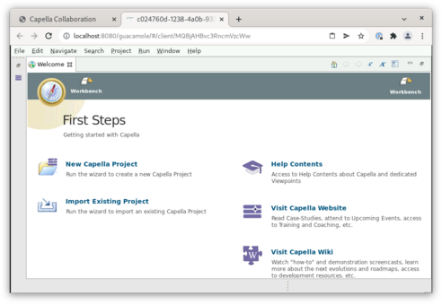

<!--
 ~ SPDX-FileCopyrightText: Copyright DB Netz AG and the capella-collab-manager contributors
 ~ SPDX-License-Identifier: Apache-2.0
 -->

# Getting Started

This guide describes the steps to get started with the Capella Collaboration
Manager.

Before you start, make sure you have a running environment. For instructions on
how to set up such an environment, please refer to the
[Development installation guide](../index.md).

First open a browser and go to http://localhost:8080.

You will be welcomed by a friendly screen and you can log in. The default setup
is running an OAuth mock service for authentication.

As username, provide the `admin` for the admin user. If you have changed the
username or want to test another user, enter your custom username.

You'll be returned to the Collaboration manager. Now you can start a session.
Select _Persistent Workspace_ and hit _Request Session_.

The system will now schedule and start a fresh workspace. Wait a bit for the
workspace to be available

Once the session is ready, click _Connect to Session_ and a new tab should
open. After a few seconds you should see the Capella splash screen and a
workspace will be shown in your browser.

## What's Next

This introduction only scratches the surface of what's possible with the
Collaboration Manager.

More advanced features include:

- Read-only models from Git
- Connect to a Team4Capella server (commercial product)
- Manage users and user access
