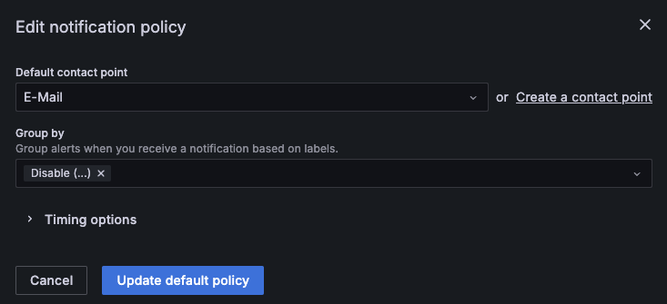

<!--
 ~ SPDX-FileCopyrightText: Copyright DB InfraGO AG and contributors
 ~ SPDX-License-Identifier: Apache-2.0
 -->

# Alerts in unexpected situations

If something doesn't work as expected, it's important that system
administrators will receive a notification.

We use the Grafana Alertmanager to send alerts for some pre-defined error
cases. If you're missing an alert rule, let us know via
[GitHub issues](https://github.com/DSD-DBS/capella-collab-manager/issues) or
open a PR and add it to the list of pre-defined rules.

## Configure alerting

By default, firing alerts can only be viewed in the Grafana UI. You can
configure additional contact points depending on your needs.

A list of available contact points is available in the
[official Grafana documentation](https://grafana.com/docs/grafana/latest/alerting/configure-notifications/manage-contact-points/).
The list includes chat services like Microsoft Teams but also email and webhook
notifications. In addition, we recommend to disable "Resolved" emails for the
configured contact points. The reason is that some alerts like failed jobs
can't be resolved which can lead to unclear messages.

!!! info "Configure SMTP server for email alerting"

    For email alerting, you need to configure an SMTP server in the
    `values.yaml` of the Helm chart. Have a look at the `alerting.email`
    configuration.

By default, alerts are grouped. If you want to disable grouping, edit the
default notification policy and set `...` as label for `Group by`:

