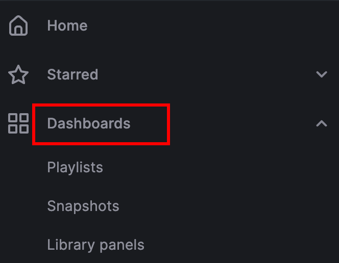

<!--
 ~ SPDX-FileCopyrightText: Copyright DB InfraGO AG and contributors
 ~ SPDX-License-Identifier: Apache-2.0
 -->

# Grafana Dashboards

We provide a few pre-configured Grafana dashboards to monitor the sessions and
TeamForCapella licenses.

The Grafana dashboards are available to administrators and can be accessed via
the "Grafana" link in the main menu. Select Dashboards to see a list of
available dashboards:

{:style="width:300px"}

You can add additional dashboards depending on your needs. If you think the
dashboard could be helpful for others, please add the dashboard to the
[list of pre-defined dashboards](https://github.com/DSD-DBS/capella-collab-manager/tree/main/helm/config/grafana)
and [open a PR](https://github.com/DSD-DBS/capella-collab-manager/pulls).
