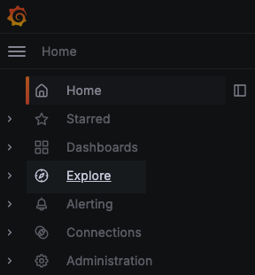
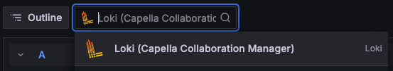
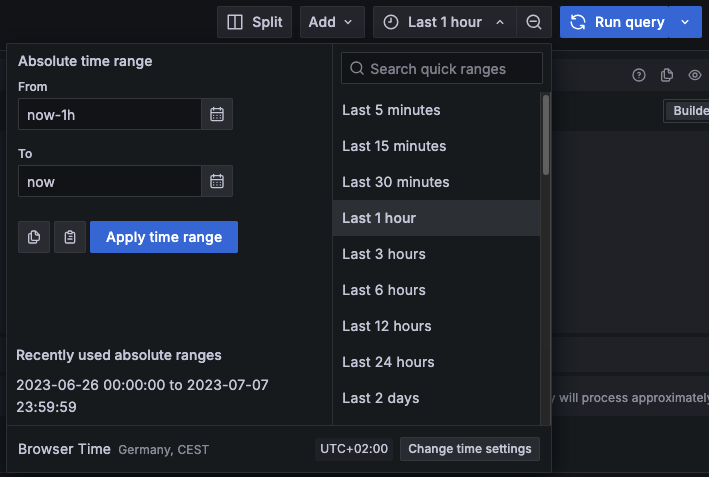
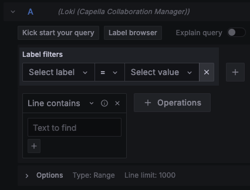
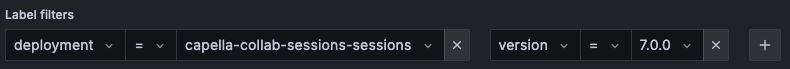
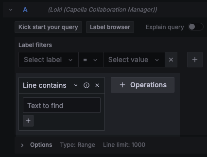
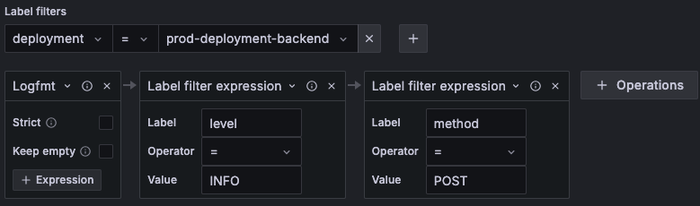
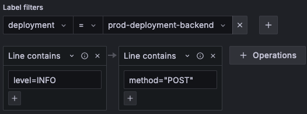
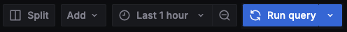

<!--
 ~ SPDX-FileCopyrightText: Copyright DB InfraGO AG and contributors
 ~ SPDX-License-Identifier: Apache-2.0
 -->

# Grafana Log Explorer

!!! note

    The Log Explorer is only available if Grafana Loki was enabled during deployment.

The Grafana Explorer can be used to view the logs of different components, such
as the backend or user sessions. The logs are stored persistently, so
administrators can also view the logs of already terminated sessions, for
example to investigate an unexpected session termination.

The Grafana Explorer is available to administrators and can be accessed from
the Grafana link in the main menu. Select "Explore" to access the log explorer:

{:style="width:300px"}

## Select the Correct Source

Before you can view logs, you must make sure that the correct source is
selected for the Capella Collaboration Manager. For this please select **Loki
(Capella Collaboration Manager)** in the data source picker.

{:style="width:500px"}

## Time Range Selector

Even though Loki is quite efficient, it is still not feasible to always query
all the data, so you need to select the time range for which you want to see
the logs, or use the default "Last 1 hour" time range. To change the time
range, open the drop-down menu in the top right corner and select the time
range you want to see.

{:style="width:450px"}

## Label Filters

The application logs are stored in Loki, which uses labels to store and
retrieve logs efficiently. This means that each log in Loki has a set of labels
assigned to it, where a label is essentially a key-value pair.

You have to select at least one label and a corresponding value to query logs.
To do this, open the **Select Label** drop-down, select a label, and then click
**Select Value**, which will load the values that exist for the label and allow
you to select a value.

{:style="width:300px"}

It is also possible to add multiple label filters by clicking the plus icon.
When you do this, you must first select a label and value for the first filter,
and when you select the second label, you will only see labels that can be
combined with the first filter. For example, if the first filter limits the
logs to backend logs, you won't be able to select anything else, while if the
first filter limits the logs to session logs, you can further restrict the
tool, version, etc.

You can query logs of different components by selecting the following labels:

-   **Management portal logs**: If you want to query the logs of the management
    portal, make use of the `deployment` label to select a component of the
    management portal.
-   **Session logs**: If you want to query the logs of a specific session, you
    can use the `username` label to select the user, and the `session_type`
    label to select the session type. You can also use the `tool` and `version`
    labels to further specify the session.
-   **Pipeline logs**: If you want to query the logs of a pipeline, you can use
    the `pipeline_run_id` label to select the pipeline run. The pipeline run
    identifiers are listed in the pipeline run overview of a pipeline.

Here is an example filter how to select all sessions for version 7.0.0.

{:style="width:800px"}

## Operations

Now as you have some logs selected by the label filters, there are some useful
operations that you can run. Due to the large number of supported operations,
this guide will only cover examples that are often used in our context.

### Line Contains

The line contains operations that essentially search the log messages for the
text you want to find.

{:style="width:400px"}

### Backend Logfmt

For our backend logs, we follow the [logfmt](https://brandur.org/logfmt), which
provides more structure to the log lines and is especially useful when used
with Loki/Grafana. The reason for this is that you can use the `Logfmt`
operation to convert the key-value pairs in our logs to labels. These labels
can then be used to filter the logs more fine-grained and efficiently.

Here is an example operation sequence where you can query all logs that have
the log level **INFO** and the HTTP method **POST**.

{:style="width:500px"}

Theoretically, you could achieve the same result by changing two line contains
operations, but it's inefficient, and you have to use the exact format as in
the log message.

{:style="width:400px"}

## Run Query

Once you have selected the appropriate label filters, added your operations,
and the time range for which you want to see the logs, you can execute the
query by clicking the query by clicking the **Run Query** button in the upper
right corner. The logs will then be queried, which may take a moment depending
on the time range you have selected and then displayed in the logs view (if you
do not see it, just scroll down a bit).

{:style="width:400px"}
