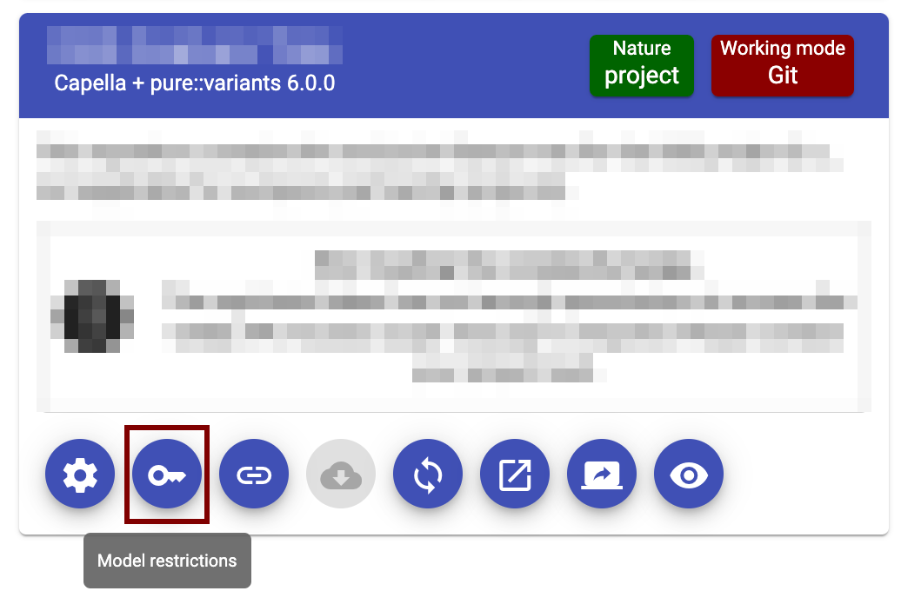
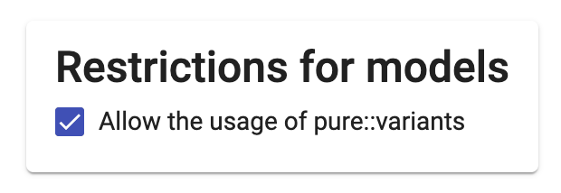

<!--
 ~ SPDX-FileCopyrightText: Copyright DB InfraGO AG and contributors
 ~ SPDX-License-Identifier: Apache-2.0
 -->

# `pure::variants` Integration

<!-- prettier-ignore -->
!!! info
    The `pure::variants` integration can be used to:

    - Use pure::variants in a browser
    - Use the pure::variants connector for Capella in a browser
    - Manage licenses as a self-service on a project level

## Setup of `pure::variants` Integration

<!-- prettier-ignore -->
!!! warning
    The setup can only be performed by administrators. If a user wants to get access, please refer to [Get access to the `pure::variants` license as user](#get-access-to-the-purevariants-license-as-user)

### Set License Server URL and Upload `license.lic`

1. Navigate to `Profile` > `Settings`
1. Select `pure::variants` in the `Integrations` section.
1. Modify the floating license server URL and confirm with `Update`.
1. Upload the `license.lic` license file.

### Add the `pure::variants` Tool to your Instance

1. Navigate to `Profile` > `Settings`
1. Select `Tools` in the `Core functionality` section.
1. Click `Add a tool`
1. Enter any tool name, e.g., `Capella + pure::variants`
1. Specify the image for the persistent workspace. More information in the
   Capella Docker images documentation:
   [`Capella + pure::variants`](https://dsd-dbs.github.io/capella-dockerimages/capella/pure-variants/)
1. Read-only workspaces and backup images are not supported. Leave the fields
   empty.
1. Click on `Create`
1. Enable the `pure::variants` integration and additional integrations if
   applicable.
1. Add tool versions (if using `Capella + pure::variants`, please use the the
   Capella version for a proper matching with the TeamForCapella server
   version.)
1. Add tool natures if applicable. If not tool nature is applicable, use a
   placeholder.

### Whitelist a Model for `pure::variants`

1. Open the project perspective of a selected project.
1. If you don't have model with the `pure::variants` tool yet,
   [create one](../../projects/models/create.md).
1. Click on the model restrictions icon:  
   {:style="width:400px"}
1. Enable `Allow the usage of pure::variants`.  
   {:style="width:300px"}
1. All members of the project should now have access to the `pure::variants`
   license server.

## Get Access to the `pure::variants` License as User

You have to get access to a project with at least one `pure::variants`
whitelisted model. More information:
[Get access to a project](../../projects/access.md). If you need a new
`pure::variants` whitelisted model, please ask your administrator.
