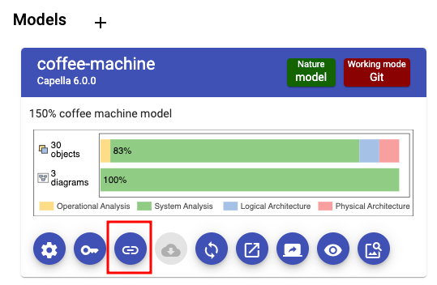

<!--
 ~ SPDX-FileCopyrightText: Copyright DB InfraGO AG and contributors
 ~ SPDX-License-Identifier: Apache-2.0
 -->

# Manage the TeamForCapella Project Integration

For all actions, you need to navigate to `Projects`, and select the model
sources button for the model.  

## Link a TeamForCapella Repository to a Project Model

1.  Click on `Use existing repository` in the `T4C Models` section.
1.  Select the TeamForCapella instance, the repository and enter a project
    name. It is recommended to have the same name for the repository and the
    Capella project.
1.  Click on `Save reference`
1.  The TeamForCapella reference should appear in the list of `T4C Models`.

    !!! info

        Users, who are members of the project,
        will get access to the repository during the next session start.
        The session token will not be updated for existing/open sessions.

## Unlink a TeamForCapella Repository from a Project Model

1.  Select the TeamForCapella reference/integration from the list.
1.  Click on `Unlink` and confirm.
1.  The TeamForCapella integration should not be listed anymore.

    !!! info

         Users, who are members of the project,
         don't have to access to the repository anymore.
         In addition, it is not listed in the dropdown menu anymore.
