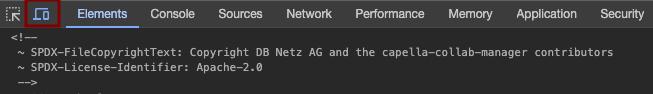
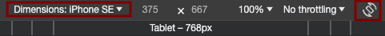

<!--
 ~ SPDX-FileCopyrightText: Copyright DB Netz AG and the capella-collab-manager contributors
 ~ SPDX-License-Identifier: Apache-2.0
 -->

# Mobile view / Responsive design

Even though opening a Capella session on a mobile device might seem
impractical, we still want to ensure the application is usable on mobile
devices.

Our goal is to ensure all features are optimized for mobile view.

## Requirements

- Smallest width is 375px (iPhone SE)
- Smallest height is 667px (iPhone SE)
- The breakpoint width between mobile and desktop view is 1280px for the
  navigation bar. When the screen is smaller than 1280px, the navigation bar is
  hidden and can be expanded by clicking on the hamburger menu. The application
  should be able to be used on all screen sizes that are wider than the
  smallest width. Therefore the breakpoint can vary from component to
  component.

## Responsive design with TailwindCSS

Tailwind supports responsive design. More information is available in the
documentation:
[Responsive Design](https://tailwindcss.com/docs/responsive-design).

For example, `class="hidden md:flex"` hides an element on mobile devices and
uses flexbox on devices larger than `768px`.

### Best Practices

- **Avoid Tables**: They're not natively responsive. Making them so demands
  significant effort.
- **Leverage Flexboxes**: Ideally, utilize `class="flex flex-wrap"` to ensure
  content adjusts appropriately on various screens.
- **Set Boundaries**: Implement `max-w-[90vw]` to avoid content spilling out of
  view. You can change the `class="90vw"` to another value, depending on your
  needs.
- **Centering Content**: When aesthetics and usability align, consider
  vertically centering elements via `class="flex justify-center"` on the parent
  element.

### Example from the application

If you want to see an code example of responsive design in the application, you
can check the `HeaderComponent` HTML template:
[frontend/src/app/general/header/header.component.html](https://github.com/DSD-DBS/capella-collab-manager/blob/main/frontend/src/app/general/header/header.component.html).
You can search for `xl:` and play around with it.

## Debugging & Testing with Chrome DevTools

!!! note

    This section specifically addresses Chrome's DevTools. Other browsers might offer similar debugging tools.

1. **Initiating DevTools**: Simply right-click on any web page element and
   choose "Inspect".
2. **Switching to Mobile View**: Click the "mobile devices" icon.
   
3. **Choose a Device or Adjust Orientation**: Pick a device from the dropdown
   or adjust the viewport rotation.  
   
