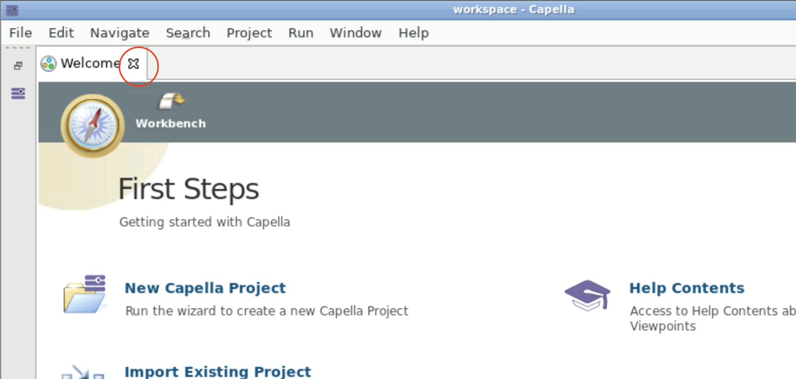

You can choose two different types of workspaces: 

### Persistent Sessions

Persistent Sessions allows you to use personal workspace within Capella.
Your personal workspace will be stored and is part of our backup routines. 
However, we still advise not to save any important information there. 
By default, we will request 20GB of storage for your personal workspace. 

If your project uses the T4C-workflow, we will suggest all visible models in the T4C connection dialog. 

???+ tip
    Starting the first time, your personal workspace will be empty. 
    Please close the `Welcome`-dialog first: 
    
    
    Please follow the [Load a model into the workspace] instructions to load models into your workspace.
!!! info
    Only work stored in the `/workspace` folder (default workspace folder) will be persistent.

### Readonly Sessions

Readonly Sessions allow you to read information from models without consuming a licence. 

!!! warning
    Readonly sessions work only with linked git models. Please ask your project manager if your model has readonly support.

!!! danger
    Any changes made in read-only sessions will NOT be saved and cannot be restored.

*[T4C]: TeamForCapella