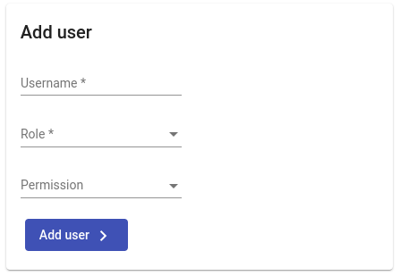
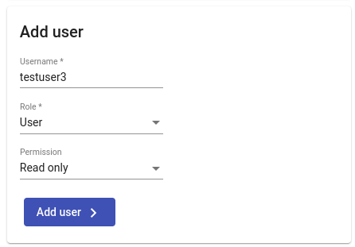
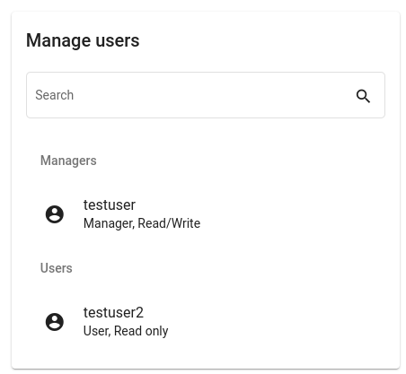
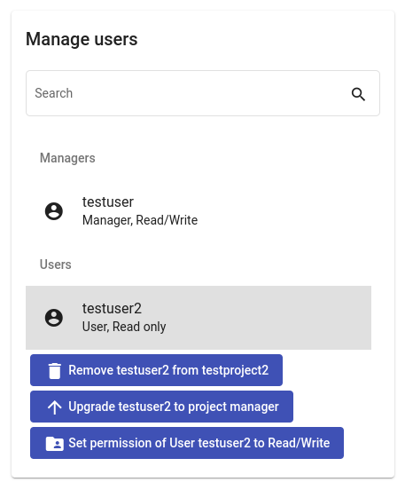

<!--
 ~ SPDX-FileCopyrightText: Copyright DB InfraGO AG and contributors
 ~ SPDX-License-Identifier: Apache-2.0
 -->

<!-- prettier-ignore -->
!!! warning
    You need to have the Administrator or Project Lead role for a
    project to perform the following steps.

## Add User to Project

1.  Select your project in the project overview.
2.  On the right side you should now see user management options:
    
3.  Fill in the following fields:

    1. `Username`: Ask your administrator if you are not sure which username to
       enter
    1. `Role` and `Permission`: Have a look here for the overview of Roles and
       Permissions: [Project roles](../projects/roles.md)

       

## Modify Role or Permissions of User

<!-- prettier-ignore-start -->

1. Select your project in the project overview.
1. On the right side you should now see user management options:
    
1. Select the user you want do modify:
    

   You can select from the following options:

   - Remove a user from the project
   - Set role of the user to [project lead](../sessions/types.md) or
     [user](../sessions/types.md)
   - Set permission of the user to [read/write](../sessions/types.md) or
     [read-only](../sessions/types.md)

    !!! info
        You can not modify your own user or any administrator!

    !!! info
        Open sessions are not terminated automatically on permission change.
        The TeamForCapella access is only revoked
        when the user's last session is terminated.

<!-- prettier-ignore-end -->
