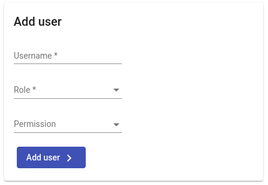
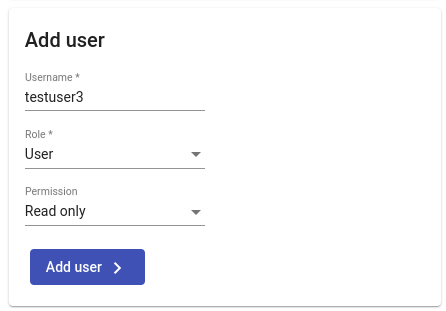
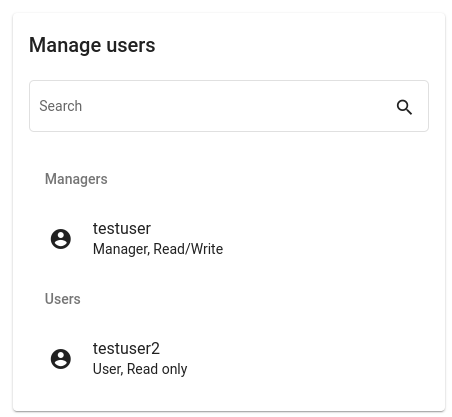
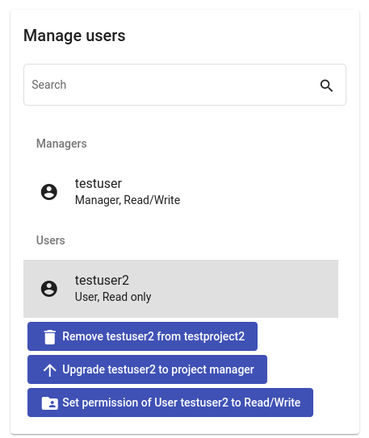

<!--
 ~ SPDX-FileCopyrightText: Copyright DB InfraGO AG and contributors
 ~ SPDX-License-Identifier: Apache-2.0
 -->

!!! warning

    You need to have the administrator or project administrator role for a
    project to perform the following steps.

## Add User to Project

!!! info

    To add a user to a project, the user has to log in to the platform at least once.

1.  Select your project in the project overview.
2.  On the right side you should now see user management options:
    
3.  Fill in the following fields:

    1. `Username`: Ask your administrator if you are not sure which username to
       enter
    1. `Role` and `Permission`: Have a look here for the overview of Roles and
       Permissions: [Project roles](../../projects/roles.md)

        

## Modify Role or Permissions of User

1.  Select your project in the project overview.
1.  On the right side you should now see user management options:
    
1.  Select the user you want to modify:  
    

    You can select from the following options:

    -   Remove a user from the project
    -   Set role of the user to
        [project administrator](../../projects/roles.md) or
        [user](../../projects/roles.md)
    -   Set permission of the user to
        [read/write](../../sessions/types/index.md) or
        [read-only](../../sessions/types/index.md)

    !!! info

         You can not modify your own user or any administrator!

    !!! info

         Open sessions are not terminated automatically on permission change.
         The TeamForCapella access is only revoked
         when the user's last session is terminated.
