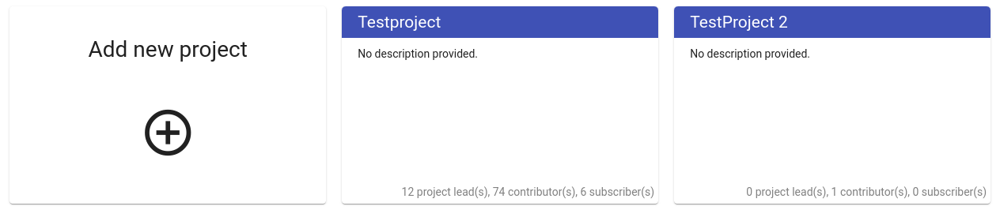
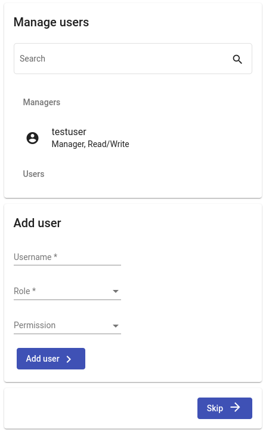

<!--
 ~ SPDX-FileCopyrightText: Copyright DB InfraGO AG and contributors
 ~ SPDX-License-Identifier: Apache-2.0
 -->

# Create a _Collaboration Manager_ Project

In the Collaboration Manager, you can follow a guided process to create
projects. Any user can create a project. After creation, you get the role
[project lead](../projects/roles.md) for the project. To create a project, go
to the _Projects_ tab of the navigation bar, and click on _Add new project_.

Please follow the steps:

## Step 1: General Information

Please enter a unique name to identify the project. The project name can not be
changed! Additionally, you may want to add a description.

## Step 2: Add Team Members

This page allows to manage the project user. By default, you are project lead
of the project. If you don't want to add an additional user, you can skip this
step. Users can be added later at any time.

## Step 3: Add Models

Please follow the model creation instructions to setup a model:
[Create a model](models/create.md)
