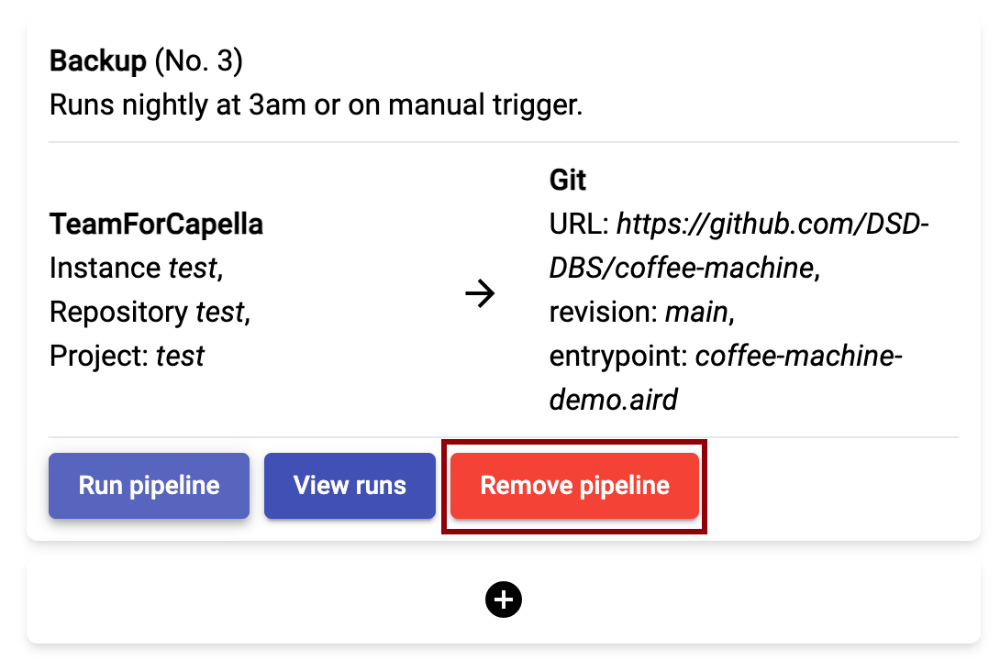

<!--
 ~ SPDX-FileCopyrightText: Copyright DB Netz AG and the capella-collab-manager contributors
 ~ SPDX-License-Identifier: Apache-2.0
 -->

# Remove a (Nightly) Backup

<!-- prettier-ignore -->
!!! warning
    Only administrators and project leads can remove pipelines.

1. Select the project in the `Projects` overview.
1. In the model overview, select the `Synchronize`-button
   
1. Select the backup pipeline you'd like to delete.
1. Click the "Remove pipeline" button:
   
