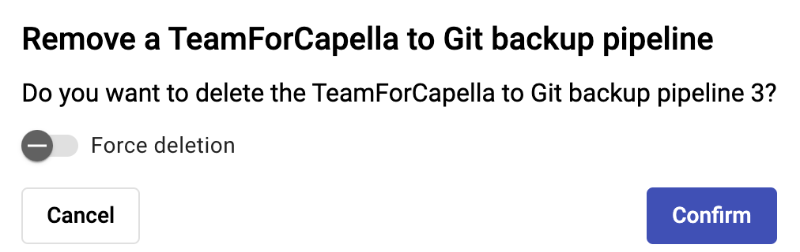

<!--
 ~ SPDX-FileCopyrightText: Copyright DB InfraGO AG and contributors
 ~ SPDX-License-Identifier: Apache-2.0
 -->

# Remove a Backup

!!! warning

    Only global administrators and project administrators can remove pipelines.

1.  Select the project in the `Projects` overview.
1.  In the model overview, select the `Synchronize`-button
    {width=50%}
1.  Select the backup pipeline you'd like to delete.
1.  Click the "Remove pipeline" button.  
    {width=50%}
1.  A new dialog will open. Confirm the deletion.  
    {width=50%}

    !!! info

        If the deletion fails due to an unreachable TeamForCapella server,
        you can make use of the "Force deletion" option. This will remove
        the pipeline, but the pipeline token will not be revoked.
        This option is only available for global administrators.
