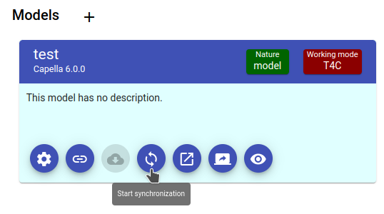
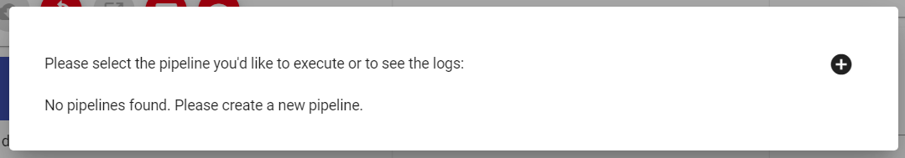
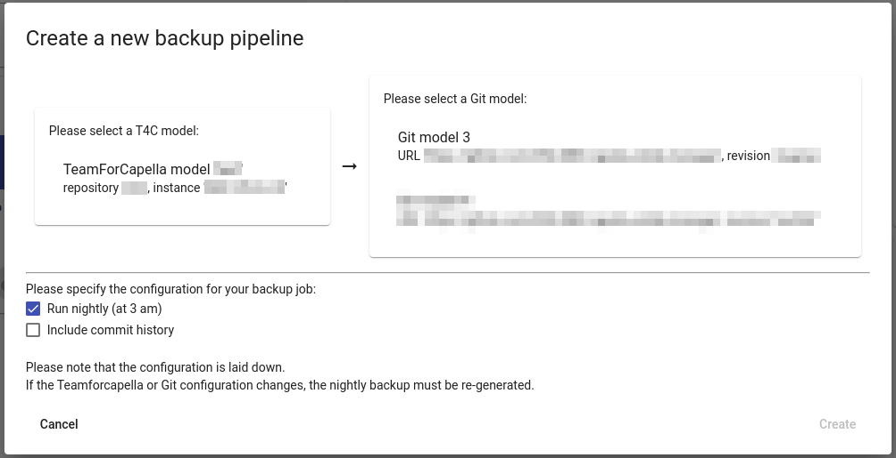

<!--
 ~ SPDX-FileCopyrightText: Copyright DB InfraGO AG and contributors
 ~ SPDX-License-Identifier: Apache-2.0
 -->

# Set up a Backup for a TeamForCapella Model

!!! warning

    You need to have the global administrator or project administrator role for a
    project to perform the following steps.

!!! danger

    Models are not automatically backed up! Please make sure to set up a regular
    backup for important content.

It's possible to create a backup from any TeamForCapella repository to any Git
repository in a project. Pipelines can be triggered manually and can be
executed on schedule. By default the schedule is set to run every night at 3am
UTC, but can be configured in the configuration.

1.  Navigate to `Projects`
1.  Select the relevant project
1.  Make sure that you have added at least one TeamForCapella model (source)
    and at least one Git repository to the model (destination)
1.  In the model overview, select the `Synchronize`-button

    {width=50%}

1.  You can see a list of all registered backup pipelines. In our case, there
    is not registered backup pipeline yet.

    {width=50%}

1.  Click on the `plus` icon and select a Git model (source) and a T4C model
    (destination).

    

1.  Confirm your selection with the `Create` button.
