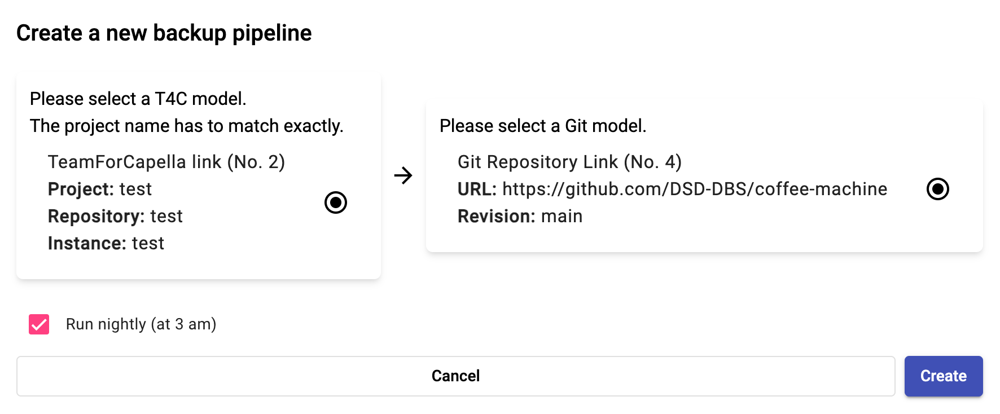

<!--
 ~ SPDX-FileCopyrightText: Copyright DB Netz AG and the capella-collab-manager contributors
 ~ SPDX-License-Identifier: Apache-2.0
 -->

# Set up a backup for a TeamForCapella model

<!-- prettier-ignore -->
!!! warning
    You need to have the Administrator or Project Lead role for a
    project to perform the following steps.

<!-- prettier-ignore -->
!!! danger
    Models are not automatically backed up! Please make sure to set up a nightly
    backup for important content.

We offer a feature to create a backup from any TeamForCapella repository to any
Git repository. These can be triggered manually and can be executed nightly at
around 3pm.

<!-- prettier-ignore-start -->

1. Navigate to `Projects`
1. Select the relevant project
1. Make sure that you have added at least one TeamForCapella model (source) and
   at least one Git repository to the model (destination)
1. In the model overview, select the `Synchronize`-button

    

1. You can see a list of all registered backup pipelines.
   In our case, there is not registered backup pipeline yet.

    

1. Click on the `Plus`-icon on the top right and select the corresponding configuration.
   You have to select a Git model (source) and a T4C model (destination).

    

    !!! Warning
        If you choose the `Include commit history`-option, backups are resource-intensive
        and each backup can take up to 5 hours depending on the size!

1. Confirm your selection with the `Create` button.

<!-- prettier-ignore-end -->
