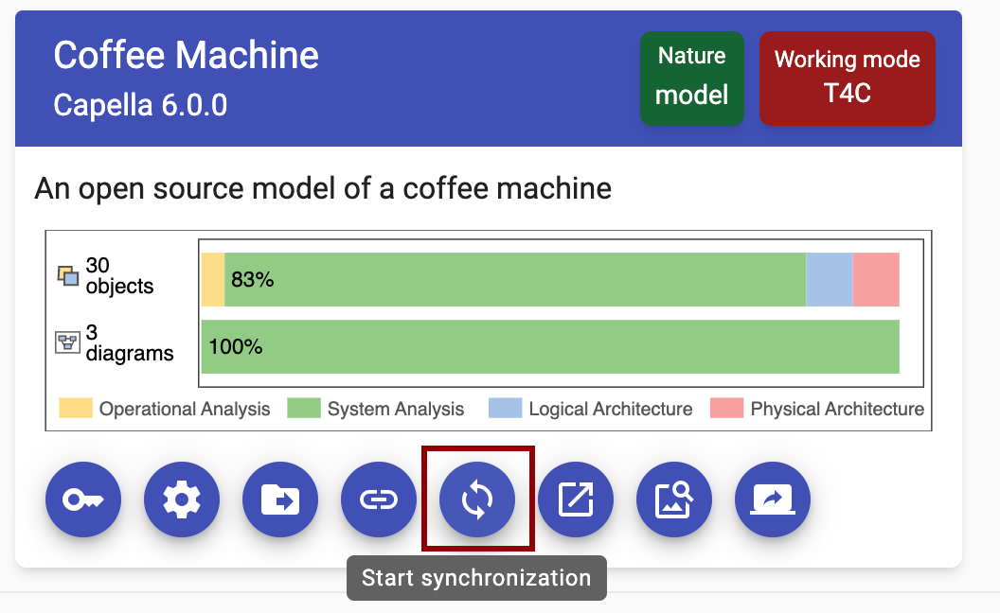

<!--
 ~ SPDX-FileCopyrightText: Copyright DB InfraGO AG and contributors
 ~ SPDX-License-Identifier: Apache-2.0
 -->

!!! warning

    To perform the following steps, you need at least one existing configured backup.

You can trigger backups at any time.

1. Select the project in the `Projects` overview.
1. In the model overview, select the `Synchronize`-button
   {width=50%}
1. Then, find the pipeline you'd like to run and click the `Run pipeline`
   button {width=70%}
