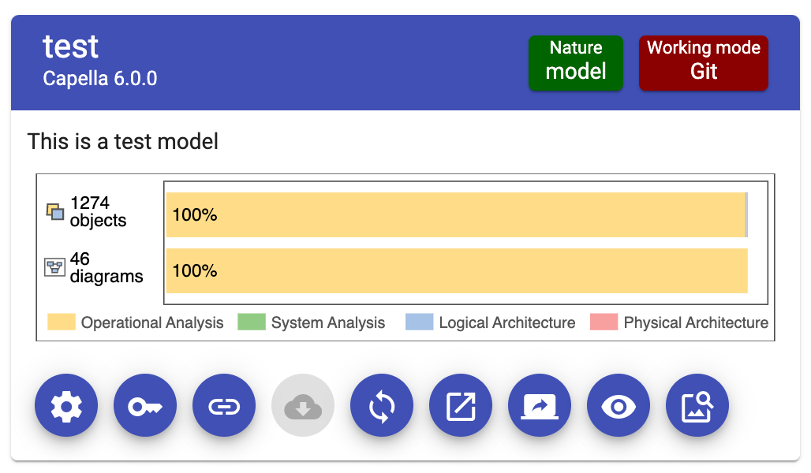

<!--
 ~ SPDX-FileCopyrightText: Copyright DB Netz AG and the capella-collab-manager contributors
 ~ SPDX-License-Identifier: Apache-2.0
 -->

# Model complexity badge integration

## Set up the complexity badge

!!! warning

    Please note the following limitations:

    - A file called `model-complexity-badge.svg` has to exist in the repository.
      We provide a Gitlab CI template and a Github action to generate the file. Find more information below.
    - Only project leads can set up the model complexity badge. In addition, one needs access to the Git repository of the model.

1.  To set up the model complexity badge, you need to add the Git API URL to
    your Git instance. More information
    [here](../../settings/model-sources/git.md).
1.  Link a Git repository to the model, for which you'd like to see the model
    complexity badge.

    <!-- prettier-ignore -->
    !!! info
         If the Github repository is public, no token is required for the model complexity badge.
         For private Github repositories and for Gitlab repositories the model complexity badge integration uses the credentials,
         which are assigned during linking the Git repository.

          - Gitlab: Limit the scope of the used token, only scope `read_api` is required.
          - Github: If you are using a fine-grained personal access token, add the repository permission for the scope "content" with access `Read-only`.

1.  Follow the CI template instructions

    - [Gitlab](https://github.com/DSD-DBS/py-capellambse/tree/master/ci-templates/gitlab#model-badge)
    - [Github](https://github.com/DSD-DBS/py-capellambse/tree/master/ci-templates/github#model-badge)

    to add the complexity badge pipeline to the linked repository.

## View the model complexity badge

The model complexity badge is visible in the model overview in the project
details:

{:style="width:400px"}
