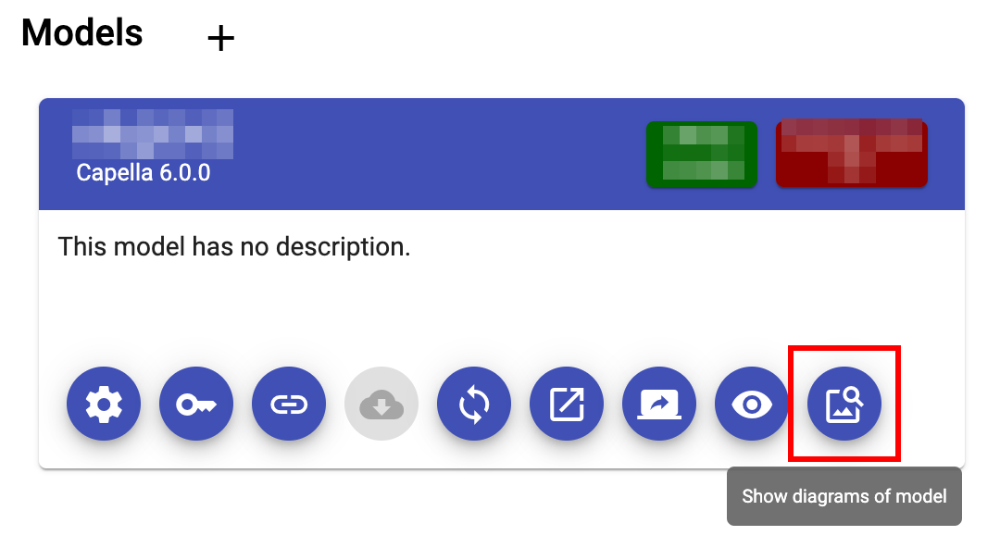
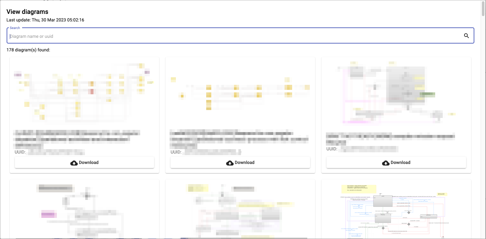

<!--
 ~ SPDX-FileCopyrightText: Copyright DB InfraGO AG and contributors
 ~ SPDX-License-Identifier: Apache-2.0
 -->

# View Diagrams via the Diagram Cache Integration

1.  Navigate to your project in the project overview.
2.  In the model overview, select the diagrams button:
    {:style="width:400px"}
3.  The diagram viewer should load and you should see all diagrams:
    

    !!! note

         We'll search for a successful job run in the last 20 pipelines of
         the specific revision. If there is no successful pipeline (using GitLab or GitHub) or your artifacts have expired (using GitHub), you won't be able
         to see diagrams.

4.  If you want to enlarge a diagram, just click on the image preview.
