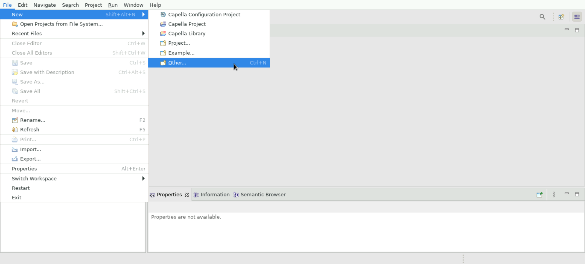

<!--
 ~ SPDX-FileCopyrightText: Copyright DB InfraGO AG and contributors
 ~ SPDX-License-Identifier: Apache-2.0
 -->

# Connect to a TeamForCapella Repository

<!-- prettier-ignore -->
!!! Info
    Please [request a persistent session](../request.md) before you continue
    with the instructions here.

To access a TeamForCapella based model you first need read/write access from a
model lead (usually this role is allocated to lead architects / area owners).

<!-- prettier-ignore-start -->

1. During the session creation, you perhaps already noticed the TeamForCapella
   session passwords. If you've already closed the dialog, please reopen it by
   clicking `Connect` for your desired session under `Active Sessions`.
   Whenever you create a session, we select all TeamForCapella models with the
   same Capella version that you have access to. For those repositories, we
   create a session password and register it with `TeamForCapella`. The access
   is revoked after session termination. Please copy the session password (you
   can just click on the text to copy it):

    

1. When Capella is finally loaded you navigate to `File` > `New` > `Other`.

    

1. Expand `Team for Capella` and select `Connect to remote model`:

    

1. In the drop down select the repository you like to work on. In most cases
   the repository and project name should match.
1. Click on `Test connection` and enter you username and the session token you
   received in the first step.
    

    !!! info
        The username in the `Test connection` dialog should be already
        pre-filled, however if this is not the case you may need to fill it in
        manually.

    !!! Bug
        Do not make use of the `Remember me` functionality.

1. When the connection test is completed successfully you can click the `Next`
   button.
1. Finally a Project selection dialog should appear - the defaults are usually
   good, just click `Finish`. This should result in a new folder
   `project-name.team` in your Project Explorer. Open the project, locate a
   file with a `.aird` extension and double-click it to open the model in
   read-write mode.

    

<!-- prettier-ignore-end -->
