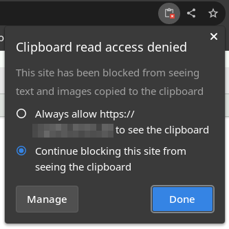

<!--
 ~ SPDX-FileCopyrightText: Copyright DB Netz AG and the capella-collab-manager contributors
 ~ SPDX-License-Identifier: Apache-2.0
 -->

## General

Some screenshot tools use the clipboard and keyboard shortcuts. This sometimes
does not work in the Capella Collaboration Manager.

## Technical Background

Some keyboard combinations are directly mapped into the containers where
Capella is running. This allows to use these keyboard combinations for actions
inside of Capella. Therefore they are not recognized on the host system.

Also, the clipboard can be shared oneway (host ➜ container). The other way does
not work for security reasons. Some tools copy screenshots directly to the
clipboard. Depending on the implementation, some screenshots get copied
directly to the container, which results in the screenshots not available in
the clipboard of the host system.

## Solution

### Snipping Tool

The Snipping tool (Windows) should just work.

### Greenshot

On some devices, the print-key does not work with screenshot, because it gets
mapped to the container. Please open Greenshot from the task bar and select
"Capture region".

### Snip & Sketch

The shortcut `Win` + `Shift` + `S` does work, but the image in not available in
the clipboard. As a solution, you can have another window in focus and take the
screenshot. Alternatively, you can forbid the use of the clipboard:

Don't forget to turn it back on after taking the screenshot.
