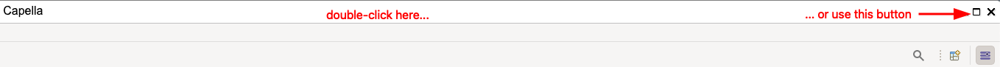

<!--
 ~ SPDX-FileCopyrightText: Copyright DB InfraGO AG and contributors
 ~ SPDX-License-Identifier: Apache-2.0
 -->

# Session Troubleshooting

<!-- prettier-ignore -->
??? question "My session window doesn't scale properly <a href="#window-scaling">:material-link:</a>"

    

    If you use a direct session connection via Guacamole, the window doesn't scale
    automatically after browser resizing. You can manually trigger a resize by
    pressing the "Refresh" button in your browser.

    Alternatively, you can use our internal session viewer, which comes with
    automatic scaling out of the box.

<!-- prettier-ignore -->
??? question "The session requests takes a long time <a href="#session-request-takes-long">:material-link:</a>"

    

    If a session takes a few minutes to start, it means that you've reached a
    new node that doesn't have the requested tool installed (for load balancing reasons,
    we distribute the sessions across different servers). This can happen after
    updates on our end (e.g. when the tool configuration or dependencies are updated)
    or updates from the cluster operator. In both cases, we pull a new Docker image
    (which can be understood as a reinstallation of the tool) on demand.

<!-- prettier-ignore -->
??? question "I've minimized my window in Xpra and can't get it back <a href="#minimized-xpra-window">:material-link:</a>"

    

    Just refresh the page in the browser. The window should appear again.

<!-- prettier-ignore -->
??? question "My read-only sessions shows 'Modelloading failed' <a href="#modelloading-failed">:material-link:</a>"

    

    This happens if the loading of one of the models fails.
    Please reach out your project lead. If you are project lead, please check
    the primary Git models with a matching tool version of your project.
    These are used for the `read-only` session. Common mistakes are wrong
    credentials, wrong entrypoints (e.g. with typos) and missing `aird`-files.

    If you have no success, please reach out your administrator. Administrators
    can see the logs of read-only sessions.

<!-- prettier-ignore -->
??? question "The TeamForCapella password doesn't work <a href="#t4c-password-doesnt-work">:material-link:</a>"

    

    Since we have released version 2, users have to use sessions passwords. More
    information can be found [here](../../tools/capella/teamforcapella/connect/index.md).
    If you have been added to a project recently while having a running session,
    please recreate your session to get a valid session password for the models
    of the required project.

<!-- prettier-ignore -->
??? question "I can't use the `Control` key for the secondary/right-click on macOS <a href="#macos-control-key">:material-link:</a>"

    

    Please use an external mouse or use the trackpad gesture (click with two
    fingers on the trackpad).

    The sessions run on Linux and the `Control` key can't be mapped properly
    via the remote desktop protocol.

    Alternatively, you can use the Xpra connection method instead of Guacamole.

<!-- prettier-ignore -->
??? question "My Xpra window doesn't react anymore <a href="#xpra-reaction">:material-link:</a>"

    

    If the Xpra window doesn't react anymore, a modal dialog in the background might block the main window.

    To identify a potential hidden dialog, double-click on the title-bar of the application in Xpra. Alternatively, you can minimize it:
    

    Then, drag the window around to see if there is any other modal dialog window. If you find one, close it.

    Another option is to refresh the browser tab. It will bring the hidden modal dialog into the foreground.
    This step might take a bit longer.
