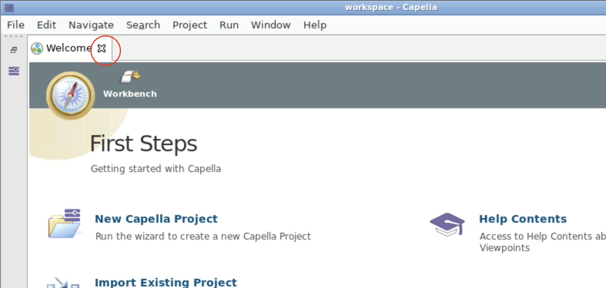

<!--
 ~ SPDX-FileCopyrightText: Copyright DB InfraGO AG and contributors
 ~ SPDX-License-Identifier: Apache-2.0
 -->

You can choose two different types of workspaces:

### Persistent Capella/Papyrus Sessions

Persistent Sessions allows you to use personal workspace within Capella. Your
personal workspace will be stored and is part of our backup routines. However,
we still advise not to save any important information there. By default, we
will request 20GB of storage for your personal workspace.

If your project uses the T4C-workflow, we will suggest all visible models in
the T4C connection dialog.

<!-- prettier-ignore -->
???+ tip
    Starting the first time, your personal workspace will be empty.
    Please close the `Welcome`-dialog first:
    

<!-- prettier-ignore -->
!!! info
    Only work stored in the `/workspace` folder (default workspace folder) will
    be persistent.

### Persistent Jupyter Notebooks

Jupyter notebooks allow you to programmatically explore (capella) models.
You'll use the same shared workspace as with persistent Capella/Papyrus
sessions. The same restrictions as with Capella sessions apply here.

<!-- prettier-ignore -->
!!! info
    Jupyter notebooks use the same `/workspace` folder as is used with
    Capella sessions.

### Readonly Capella/Papyrus Sessions

Readonly Sessions allow you to read information from models without consuming a
license.

<!-- prettier-ignore -->
!!! warning
    Read-only sessions work only with linked git models. Please ask your project
    lead if your model has read-only support.

<!-- prettier-ignore -->
!!! danger
    Any changes made in read-only sessions will NOT be saved and cannot be restored.

<!-- prettier-ignore -->
*[T4C]: TeamForCapella
