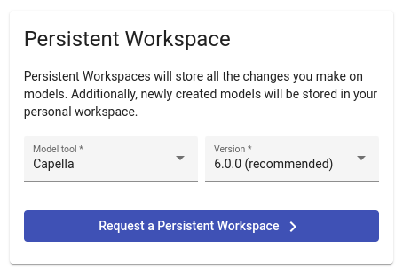
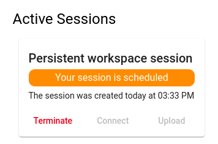
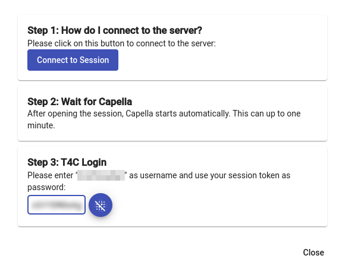

<!--
 ~ SPDX-FileCopyrightText: Copyright DB Netz AG and the capella-collab-manager contributors
 ~ SPDX-License-Identifier: Apache-2.0
 -->

# Getting Started with a Persistent Session

<!-- prettier-ignore-start -->

1. To get started with a persistent session, you have to navigate to
   `Sessions`.
2. Please select the tool and the version you'd like to work with:
    
3. You should see your session listed under `Active sessions` on the right.
    

   Session spin-up may take up to 30 seconds before the connection button will
   get enabled. First time start may take up to 1 minute.

4. Click the `Connect` button when it's enabled. A new popup opens, where you
   can select `Connect to Session`. A new browser tab should open and you see
   Capella loading.
    

    !!! info
        You can find your TeamForCapella session password in the connection
        dialog. Please follow the [`TeamForCapella` guide](../flows/t4c.md)
        for more information.

5. When Capella is loaded you can start working.

    !!! info "Do you need access to a TeamForCapella model?"
        Please continue with the [Connect to a `TeamForCapella` repository guide](../flows/t4c.md).

<!-- prettier-ignore-end -->
