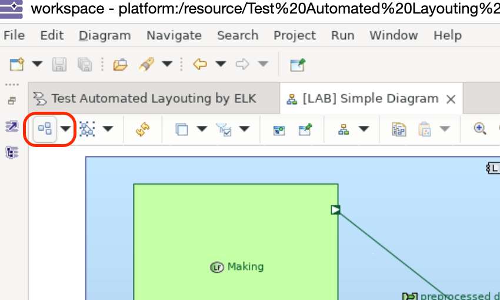
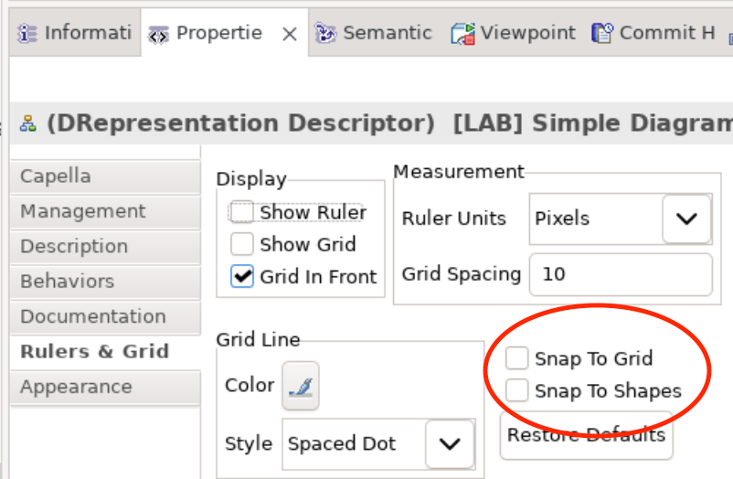
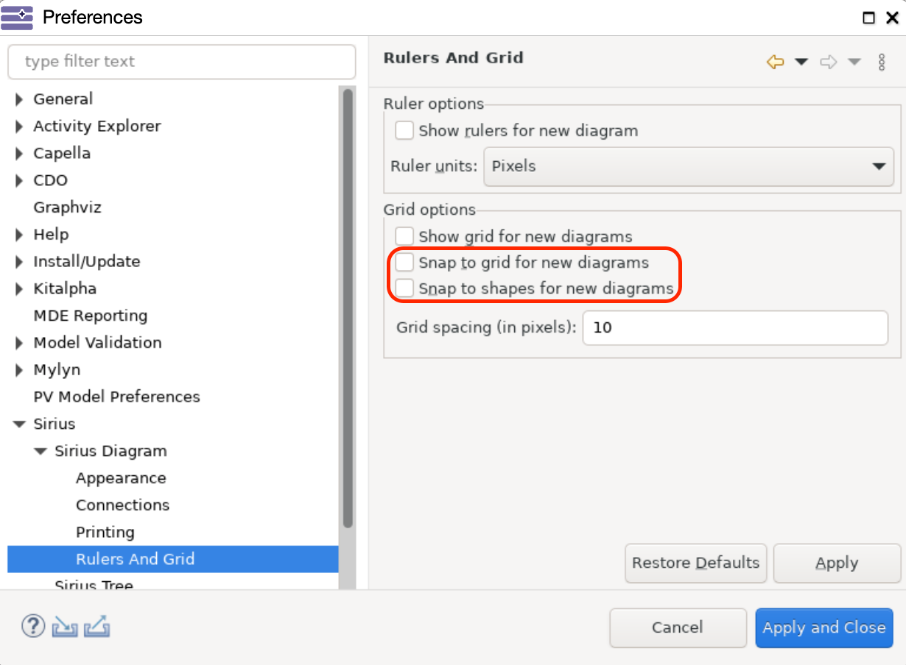

<!--
 ~ SPDX-FileCopyrightText: Copyright DB InfraGO AG and contributors
 ~ SPDX-License-Identifier: Apache-2.0
 -->

# ELK - Diagram Layouting in Capella

!!! warning

    The extension is currently not publicly available.
    To find out if the extension is available in your environment, contact your system administrator.

We have integrated the [ELK Layered algorithm](https://eclipse.dev/elk/) to
enhance the native layouting capabilities of Capella. While no user-facing
configuration is currently exposed, we provide sensible defaults, for example
the layout direction is set to _left-to-right_.

> ⚠️ **Note**: This layouting feature is not compatible with advanced diagram
> types such as **Sequence**, **Activity**, or **State Machine** diagrams.

## How to Use

You can trigger the layout algorithm using the ELK layout button located in the
diagram control bar:

## Layout Optimization

For optimal results **disable** the following options in the diagram’s
properties:

- _Snap to grid_
- _Snap to shapes_

These settings can be found in the diagram’s properties panel:

To make this the default behavior navigate to: Window > Preferences > Sirius >
Sirius Diagram > Rulers And Grid and uncheck the respective snapping options:

