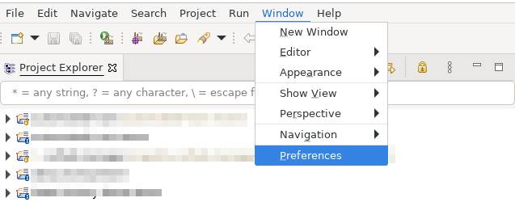
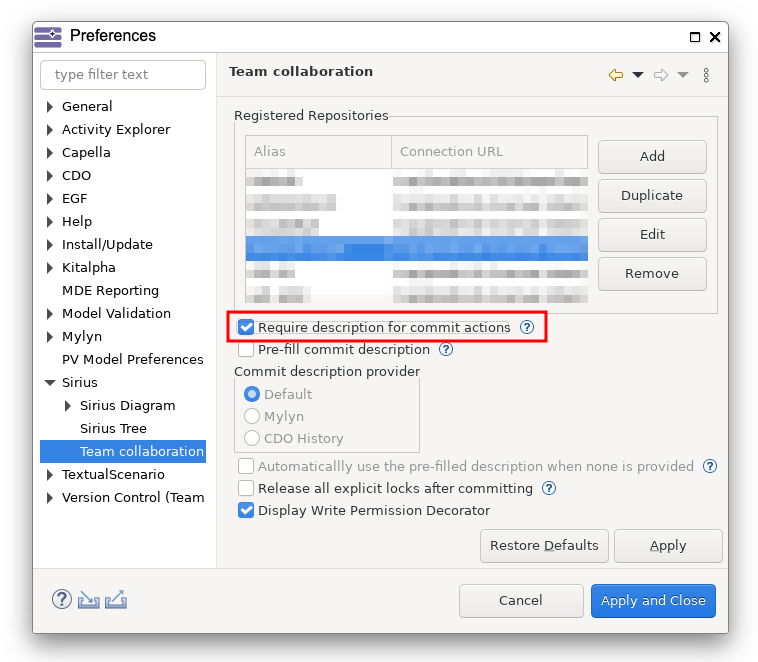
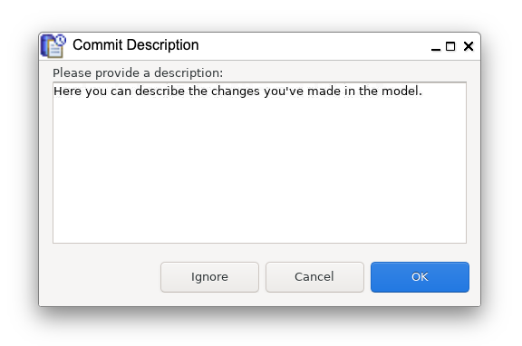
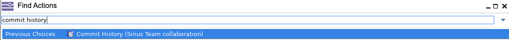
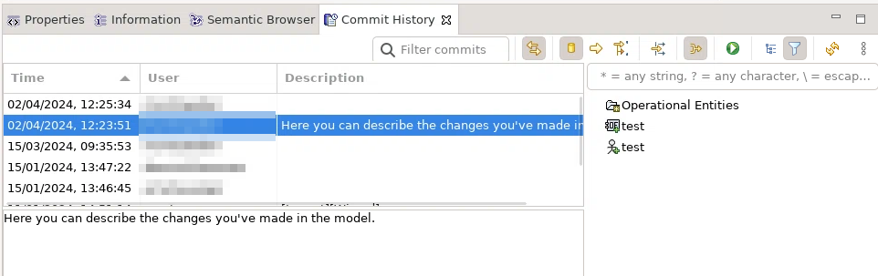

<!--
 ~ SPDX-FileCopyrightText: Copyright DB InfraGO AG and contributors
 ~ SPDX-License-Identifier: Apache-2.0
 -->

# Work with TeamForCapella commits and commit messages

!!! Info

    Please [request a persistent Capella session](../../../../sessions/request.md) before you continue
    with the instructions here.

## Enable commit message prompt

If you want to provide commit messages when saving your changes in
TeamForCapella, you can enable a dialog that will prompt you to enter a message
each time you save your changes:

1. Navigate to `Window` > `Preferences`:  
   
1. In the `Preferences` dialog, navigate to `Sirius` > `Team Collaboration` and
   enable the `Require description for commit actions` option:  
   
1. Save the changes with "Apply and Close".

## Provide a commit message

!!! Warning

    The commit description dialog will only appear if enabled as described in the previous section.

1. Connect to a TeamForCapella repository.
1. Make some changes to the model.
1. Save your changes. A dialog will prompt you to enter a commit message:
   
1. Confirm with "OK". If you don't want to provide a commit message, you can
   click on "Ignore".

## View the commit history

1. Open the Capella search via the search icon in the top right corner.
1. Search for commit history and select
   `Commit History (Sirius Team collaboration)`:  
   
1. The commit history view opens. It will show the changes of the selected
   element and children in the project explorer. Select the `.aird` file for
   the full project commit history. You can click on specific commits to see
   the modified elements:  
   
