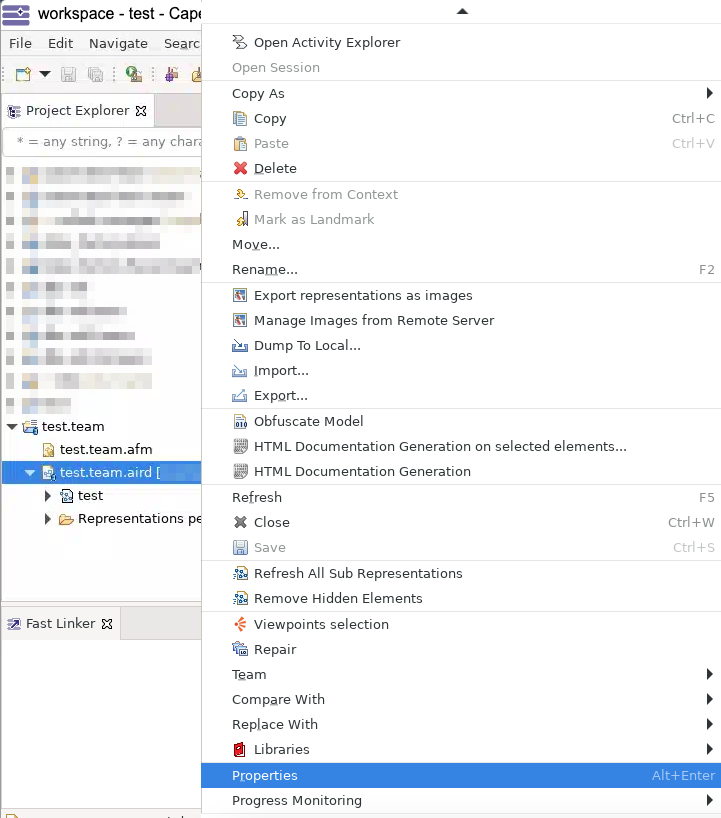
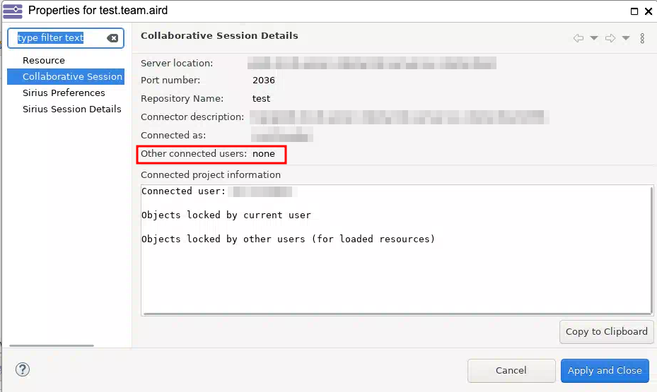

<!--
 ~ SPDX-FileCopyrightText: Copyright DB InfraGO AG and contributors
 ~ SPDX-License-Identifier: Apache-2.0
 -->

# See who is connected to a TeamForCapella repository

You can see who is connected to a TeamForCapella repository:

1. Start a persistent session.
1. [Connect to the TeamForCapella repository](../connect/index.md).
1. Right-click on the `*.aird.team` file and select Properties:  
   {:style="width:500px"}
1. In the opened dialog, select `Collaborative Session` in the left menu. You
   can see the list of connected users in the `Other connected users` row:  
   
