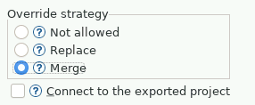

<!--
 ~ SPDX-FileCopyrightText: Copyright DB Netz AG and the capella-collab-manager contributors
 ~ SPDX-License-Identifier: Apache-2.0
 -->

# Export a Capella Model from your Persistent Workspace to a TeamForCapella Server

<!-- prettier-ignore -->
!!! warning
    To export a Capella model to a TeamForCapella server, you need
    at least the `Read/Write`-permission for the project.

1. Open a persistent session with the corresponding Capella version.
1. Wait until Capella has started.
1. Expand the project you'd like to export in the Project explorer.
1. Right-click on the `.aird` file.
1. Select `Export` in the menu.
1. A dialog with the title `Select` should open. Expand `TeamForCapella`,
   select `Capella Project to Remote Repository` and confirm with `Next`:
   
1. Select the repository from the dropdown menu. Click on the `Test connection`
   button and enter your [session token](../../../../sessions/flows/t4c.md).
   Click on `Next`.
   
1. Select the overwrite strategy. If the project doesn't exist on the server
   yet, choose `Replace`. Otherwise, select `Merge`.
   
1. In the next step, you have to select images to export.
1. Finish the export with `Finish`.
