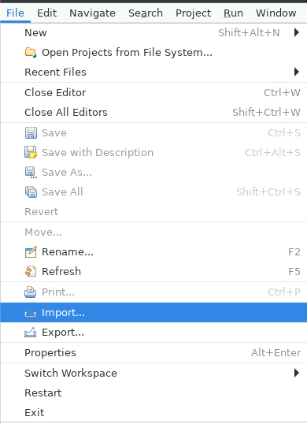
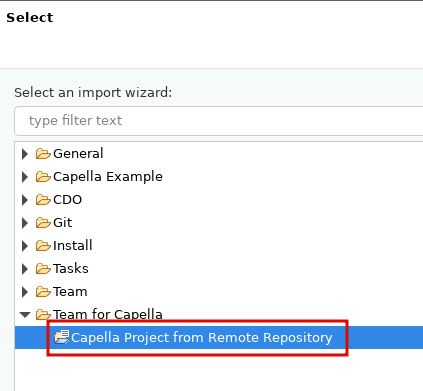
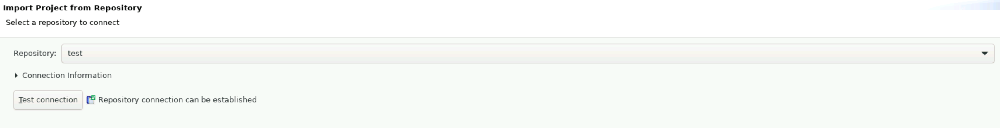
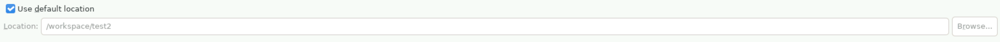
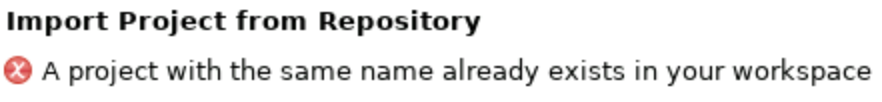
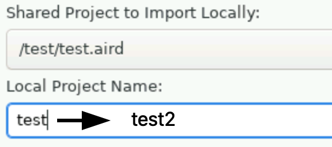
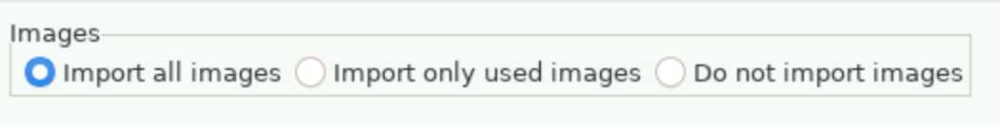
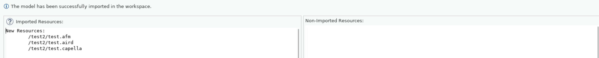

<!--
 ~ SPDX-FileCopyrightText: Copyright DB InfraGO AG and contributors
 ~ SPDX-License-Identifier: Apache-2.0
 -->

# Import a Capella Model from a TeamForCapella Server into your Persistent Workspace

<!-- prettier-ignore -->
!!! warning
    To import a Capella model into your persistent workspace, you need
    at least the `Read/Write`-permission in the project.

<!-- prettier-ignore -->
!!! info
    This imports a model into your workspace and changes are not automatically saved
    back to the T4C repository. If you want to save changes directly back to the server
    use [this](../../../../sessions/flows/t4c.md) documentation.

1. Open a persistent session with the corresponding Capella version.
1. Wait until Capella has started.
1. Click on `File` > `Import...`.  
   
1. A dialog with the title `Select` should open. In the dialog, expand
   `TeamForCapella`, select `Capella project from remote repository` and
   confirm with `Next`.
   
1. Select the repository from the dropdown menu. Click on the `Test connection`
   button and enter your [session token](../../../../sessions/flows/t4c.md).
   
1. Click on `Next` .
   <!-- prettier-ignore -->
    !!! warning
        Do NOT modify the default location. Only the `/workspace` directory is persistent.
        
   <!-- prettier-ignore -->
    !!! hint
        
        If you get the message `A project with the same name already exists in your workspace`,
        change the name in the `Local Project Name` field.
        

1. Select `Import all images` during the next step (step does not exist on
   Capella 5.x.x). 
1. Confirm with `Finish`. You should see a success message:
   
1. Click on `Ok` and the project should appear in your persistent workspace.
