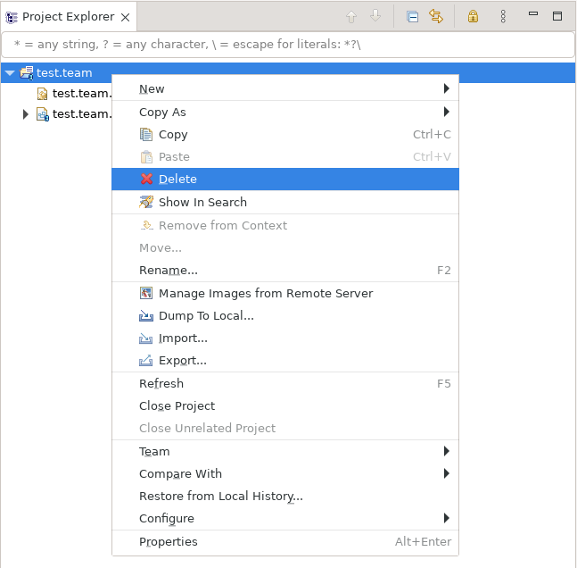
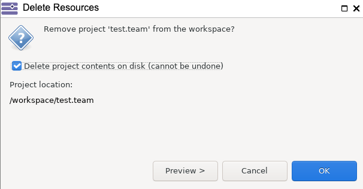

<!--
 ~ SPDX-FileCopyrightText: Copyright DB InfraGO AG and contributors
 ~ SPDX-License-Identifier: Apache-2.0
 -->

You probably got this page because one of your models has been migrated to a
newer version of Capella. After the migration, there are some manual steps that
you need to follow in order to continue working with the model:

1. Request a session with the new Capella version. Identify the migrated
   projects and remove the old `.team` projects from your workspace:

    {:style="width:400px"}

    A popup will appear asking you to confirm the deletion. Tick the box to
    delete the project from the disk and confirm:

    {:style="width:400px"}

1. Connect to the new TeamForCapella repository:
   [Connect to a TeamForCapella repository](../connect/index.md)
