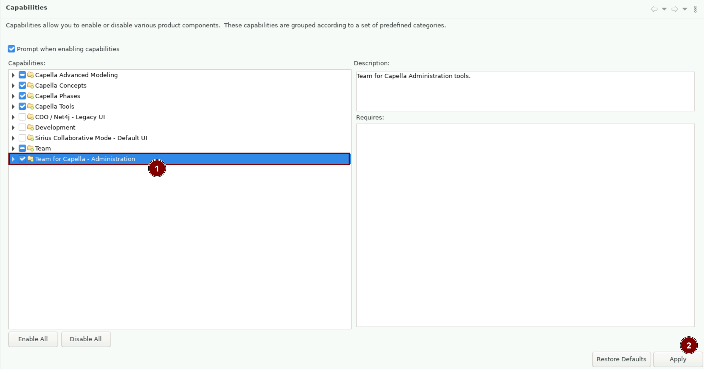
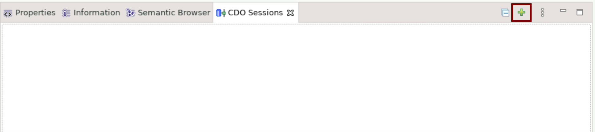
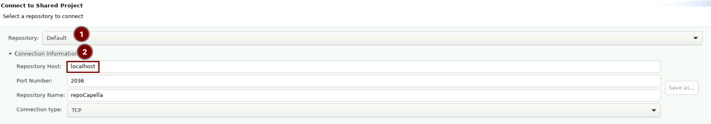
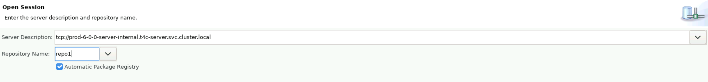
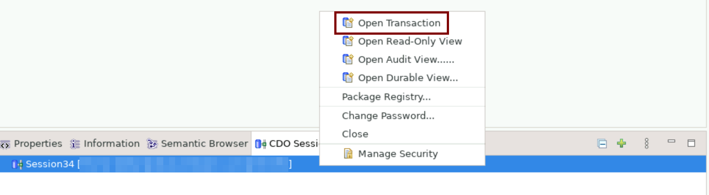
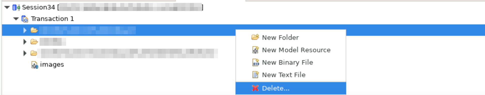

<!--
 ~ SPDX-FileCopyrightText: Copyright DB Netz AG and the capella-collab-manager contributors
 ~ SPDX-License-Identifier: Apache-2.0
 -->

# TeamForCapella Project Management

This page describes how to manage T4C projects in T4C repositories. It does not
cover the management of T4C repositories. For the management of T4C
repositories, refer to the
[TeamForCapella repository management](../repository-management.md) guide.

## Create a new TeamForCapella project

1. Make sure that you have a T4C repository available. If not, refer to the
   [TeamForCapella repository management](../repository-management.md) guide.
1. Create an empty Capella project in your workspace. Then, export it to the
   T4C repository. For more information, refer to the
   [TeamForCapella project export](../export/export-to-t4c.md) guide.

## Delete a TeamForCapella project

!!! warning

    To delete a TeamForCapella project, you have to be global administrator in Collaboration Manager.

<!-- prettier-ignore -->
1. Open a persistent Capella session and connect to it.
1. Enable the TeamForCapella administration capability:   `Window` >
   `Preferences` > `General` > `Capabilities`:
   
   Then close the dialog.
1. Open the Capella search and search for `CDO Sessions (CDO)` and open it.
1. Add a new CDO connection:
   .
1. Enter the connection string for the TeamForCapella server. There two ways to
   find the correct one. Make sure that the host is prefixed with `tcp://`.

    1. Global administrators can navigate to `Profile` > `Settings` >
        `Model sources` > `TeamForCapella` > Select the instance > `Host`.
    1. Project managers can use the TeamForCapella connection flow described in
        the [Connect to a TeamForCapella repository](../../../../sessions/flows/t4c.md)
        guide. In the `Connect to Shared Project` dialog, select the repository,
        expand "Connection information" and copy the "Repository host".
        

1. Enter the repository name and confirm with "Ok".
    
1. Open a CDO session transaction:
    
1. Expand the transaction, select the project to delete, right click, and select "Delete...":
    
1. Confirm the deletion with "Ok" and wait until the transaction is finished.
   The can take a few minutes.
