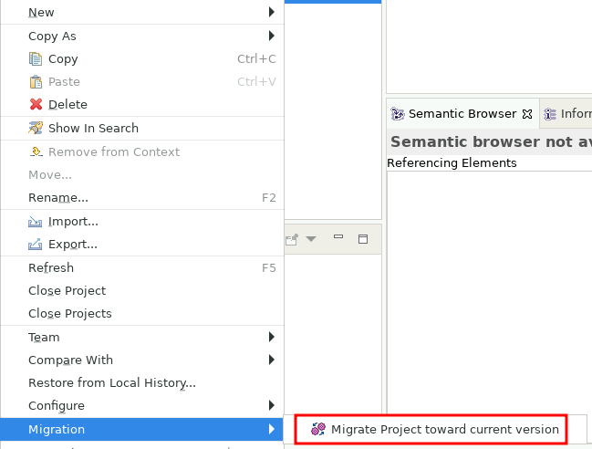

<!--
 ~ SPDX-FileCopyrightText: Copyright DB Netz AG and the capella-collab-manager contributors
 ~ SPDX-License-Identifier: Apache-2.0
 -->

# How to Update a Capella Model to a Higher Version (in TeamForCapella)

<!-- prettier-ignore -->
!!! warning
    Please create backups (e.g., in a Git repository) before you start the update process.
    A downgrade of Capella models is not possible.

1. Open a new persistent session with the old Capella version.
1. Import the model from the TeamForCapella server via the Import wizzard from
   TeamForCapella into your local workspace:
   [Import a model from TeamForCapella](./import/import-from-t4c.md)
1. Terminate the session.
1. Remove existing backups from TeamForCapella:
   [Remove a (nightly) backup](../../../projects/models/backups/remove.md)
1. Add a new repository in the TeamForCapella settings:
   [Add a new TeamForCapella repository](./repository-management.md#add-a-new-teamforcapella-repository)
1. Unlink the old TeamForCapella repository (old Capella version) from your
   model:
   [Unlink a TeamForCapella repository](../../../projects/models/sources/t4c.md#unlink-a-teamforcapella-repository-from-a-project-model)
1. Link the new TeamForCapella repository (new Capella version) to your model:
   [Link a TeamForCapella repository](../../../projects/models/sources/t4c.md#link-a-teamforcapella-repository-to-a-project-model)
1. Update the model version to the newer Capella version:
   [Change model metadata](../../../projects/models/metadata.md)
1. Create a new session with the new Capella version.
1. In your persistent workspace, execute the following steps:
   <!-- prettier-ignore -->
    1. Right click on the model in your workspace.
    1. Select `Migration` and `Migrate Project toward current version`
       
    1. A backup is not required as the latest version should still be available
       on the old TeamForCapella server.
       

1. Export the model to the new TeamForCapella server via the Export wizzard
   from TeamForCapella:
   [Export a model to TeamForCapella](./export/export-to-t4c.md)
1. Recreate the backup from TeamForCapella:
   [Set up a TeamForCapella backup](../../../projects/models/backups/setup.md)
