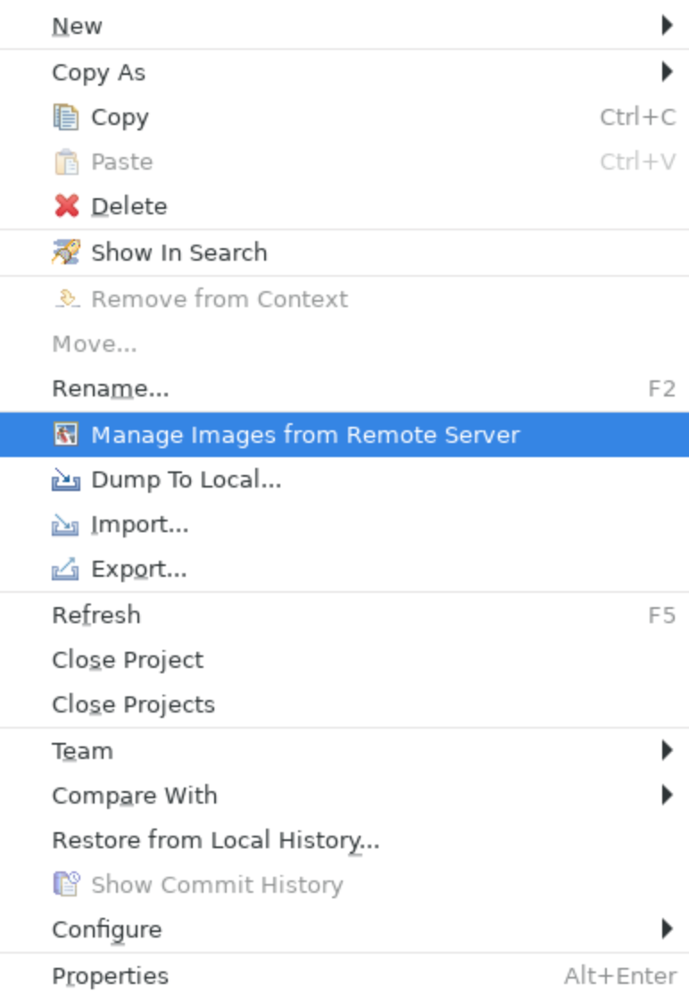
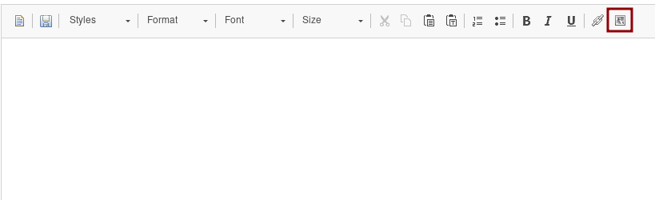
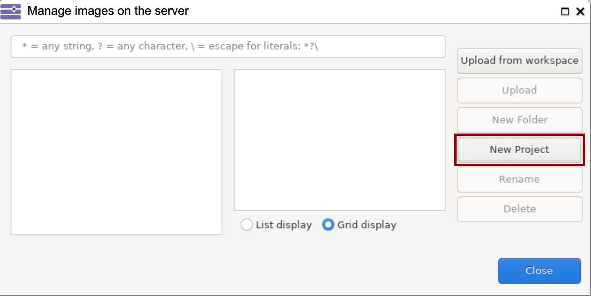
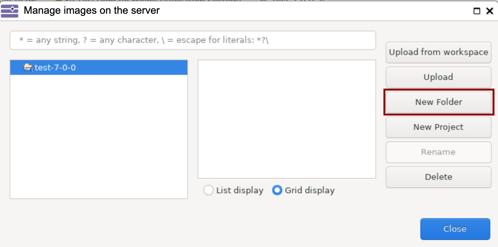
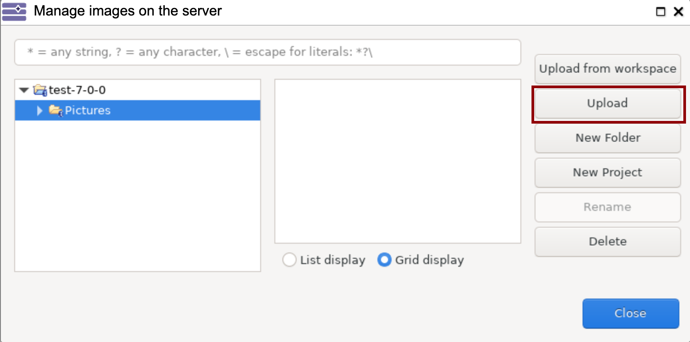
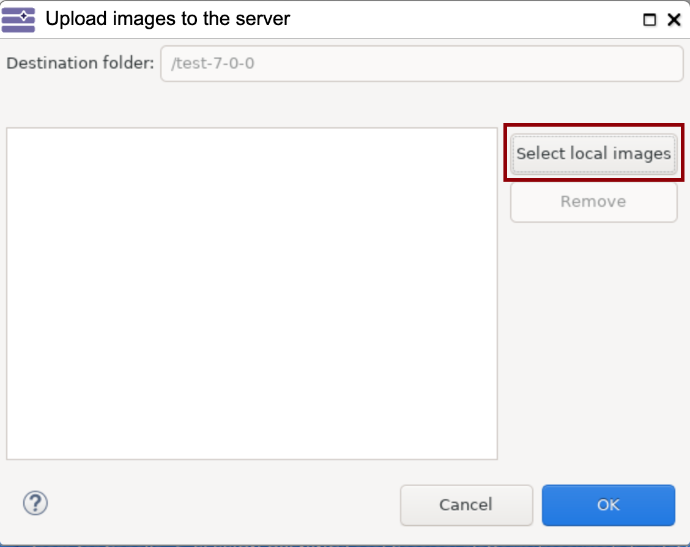
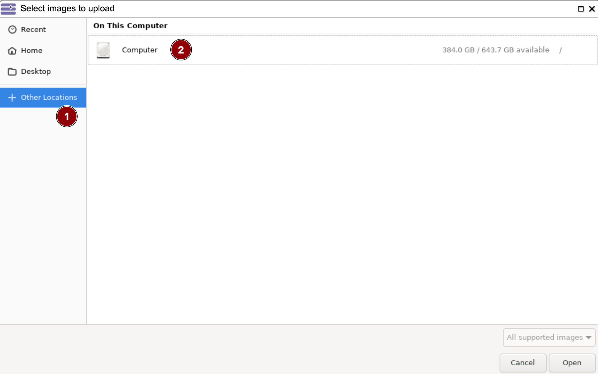
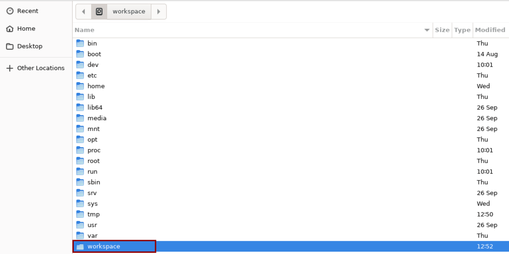

<!--
 ~ SPDX-FileCopyrightText: Copyright DB InfraGO AG and contributors
 ~ SPDX-License-Identifier: Apache-2.0
 -->

1.  Upload the image into your personal session workspace via the file browser
    upload:
    [Upload files](../../../../sessions/files/index.md#browse-upload-and-download-files)
1.  Connect to the TeamForCapella repository:
    [Connect to a TeamForCapella repository](../connect/index.md)
1.  Right-click on the `.team` project and select
    `Manage Images From Remote Server`:
    {:style="width:200px"}

    Alternatively, you can also open the dialog via the image icon from the
    description editor:
    

1.  Choose the project name on the left side, expand it and select the folder
    `Images`.

    !!! danger "Important"

        Do not upload images in the `*.team` project! Use the project name without the `.team`
        suffix. Otherwise, images are not available after exports of the model.

    !!! info "Project or folder not listed?"

        If the project is not listed, you can create a new project:

        1. Click `New Project` on the right side:  
           {:style="width:400px"}
        1. Enter the project name without the `.team` suffix.
           Make sure that the project name matches exactly.
        1. Confirm with `Ok`.
        1. In the new project, create a new folder with `New Folder`:  
           {:style="width:400px"}
        1. Enter `Pictures` as name of the new folder and confirm.

1.  Upload the images via the `Upload` button:

    

    1. In the open dialog, select `Select local images`:
       

    1. Select `Other Locations` and `Computer`:
       

    1. Select `workspace`: 

    1. In this folder you can see the files uploaded via the File Browser.
       Select the images to upload and click `Open`.

    1. Confirm with `Ok`

1.  Once uploaded, the images can be embedded using the description editor.
1.  Commit the changes on the server.
