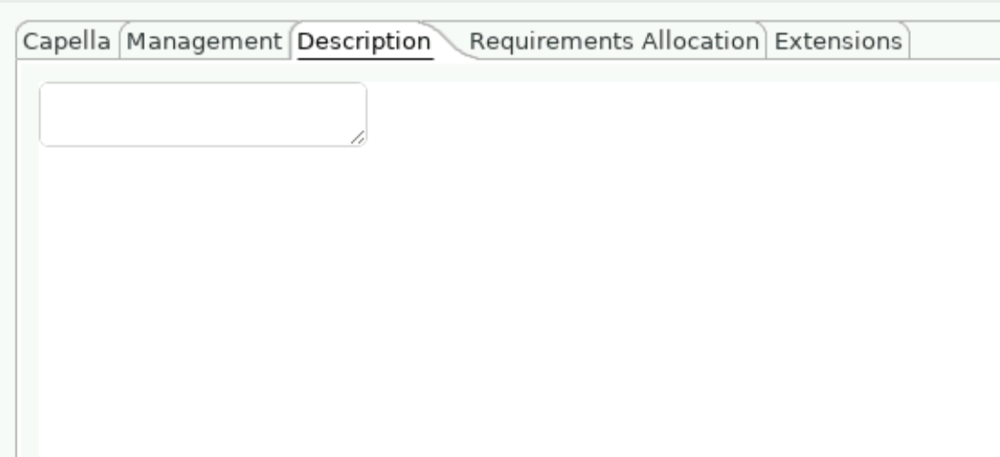
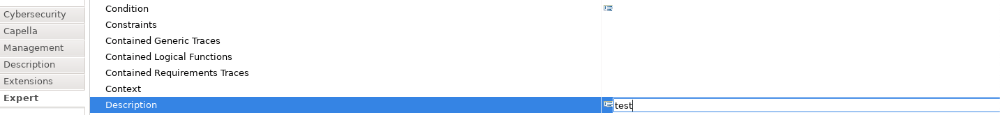
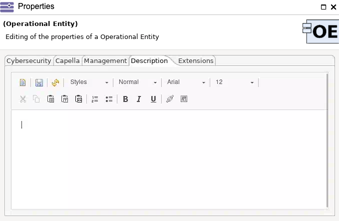
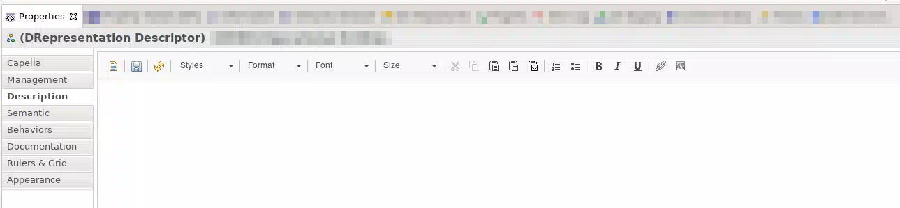
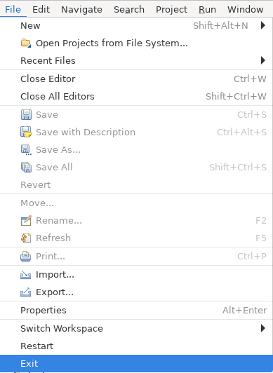

<!--
 ~ SPDX-FileCopyrightText: Copyright DB InfraGO AG and contributors
 ~ SPDX-License-Identifier: Apache-2.0
 -->

# Capella Troubleshooting

!!! question "My Capella crashed. What should I do?"

    Capella can crash for many different reasons. Many issues are issues with
    Eclipse Capella itself, so we try to escalate issues there. Bugs can be
    reported to the Eclipse Capella team directly in the
    [Github repository](https://github.com/eclipse/capella/issues).

    Administrators can see the logs of all sessions to identify the issues
    remotely. In addition, the session owner can also see the events in the UI.
    In your session, please follow these steps:

    1. Open the Capella search via the search icon.
    1. Search for `Event Logs (General)` and open the view.
    1. You should now see the list of events and you can try to find an entry with
       a matching timestamp.

!!! question "The description editor doesn't load anymore"

    In some cases the description doesn't load anymore, is just a blank page, or looks like this:

    {:style="width:400px"}

    This is a common and known bug in Capella itself. We have reported it to the Capella contributors,
    but the bug originates in the Eclipse/Nebula framework. The bug was fixed in Eclipse version
    4.24. Capella 6.0.0 and 6.1.0 are based on Eclipse 4.20, so the bug is still present in these versions.
    Capella 7.0.0 is based on Eclipse 4.27 and the description editor issues are fixed.

    If you are experiencing this problem, please try one of the following workarounds:

    - Use the "Semantic" or "Expert" view in Capella to modify the description.
      To do so, open the properties tab of the element you want to edit and click on the "Semantic" or "Expert" tab.
      In this editor, rich text is not supported! You have to enter valid HTML. The content is not validated
      and may later impact other components of the toolchain if invalid.

        

    - Open the description editor by double-clicking the model element you want to edit, and open the description editor from the overlay:
      
    - Open the Description Editor from the Properties tab:
      
    - Reopen Capella in the current session from the task bar at the top of the session window. Expand `File` and close Capella. It will reopen automatically.

        

    - End your session and request a new session in the Capella Collaboration Manager.

    If none of these workarounds help, the only solution is to reset your workspace. Please contact your administrator for assistance.
