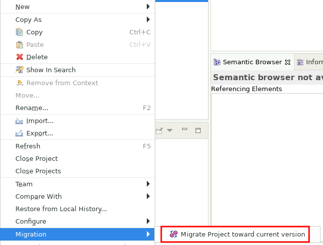
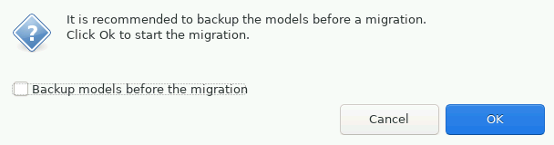

<!--
 ~ SPDX-FileCopyrightText: Copyright DB InfraGO AG and contributors
 ~ SPDX-License-Identifier: Apache-2.0
 -->

# Update a Capella Model to a Newer Version

<!-- prettier-ignore -->
!!! warning
    Create backups (e.g. in a Git repository) before you start the update process.
    A downgrade of Capella models is not possible.

<!-- prettier-ignore -->
!!! info
    If you want to update a Capella model saved in TeamForCapella, please follow the Capella specific instructions instead:
    [Update a TeamForCapella based Capella model](../../tools/capella/teamforcapella/update.md)

1. Open a new persistent session with the old Capella version.
1. Import the model into your workspace.
1. Terminate the session.
1. Update the model version to the newer Capella version:
   [Change model metadata](../../projects/models/metadata.md)
1. Create a new session with the new Capella version.
1. In your persistent workspace loaded, execute the following steps:
   <!-- prettier-ignore -->
    1. Right click on the model in your workspace.
    1. Select `Migration` and `Migrate Project toward current version`
       
    1. A backup is  recommended.
       
