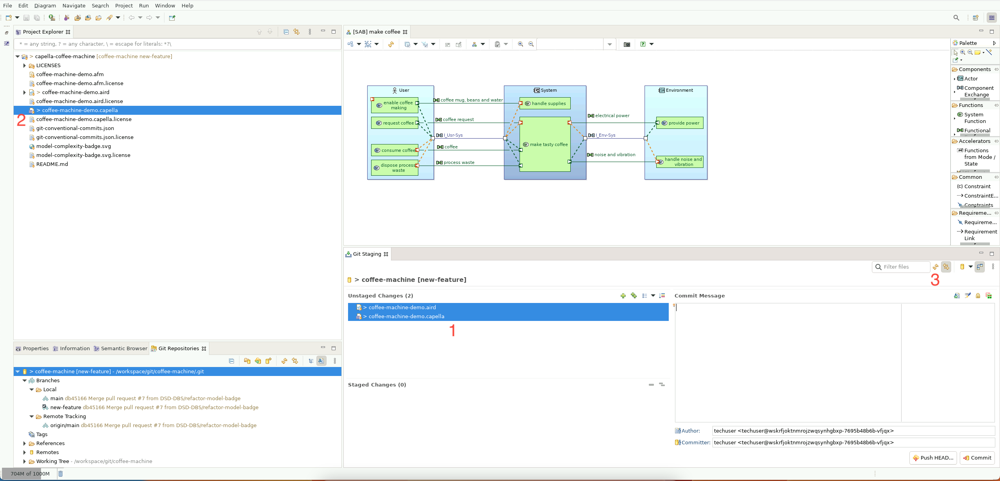
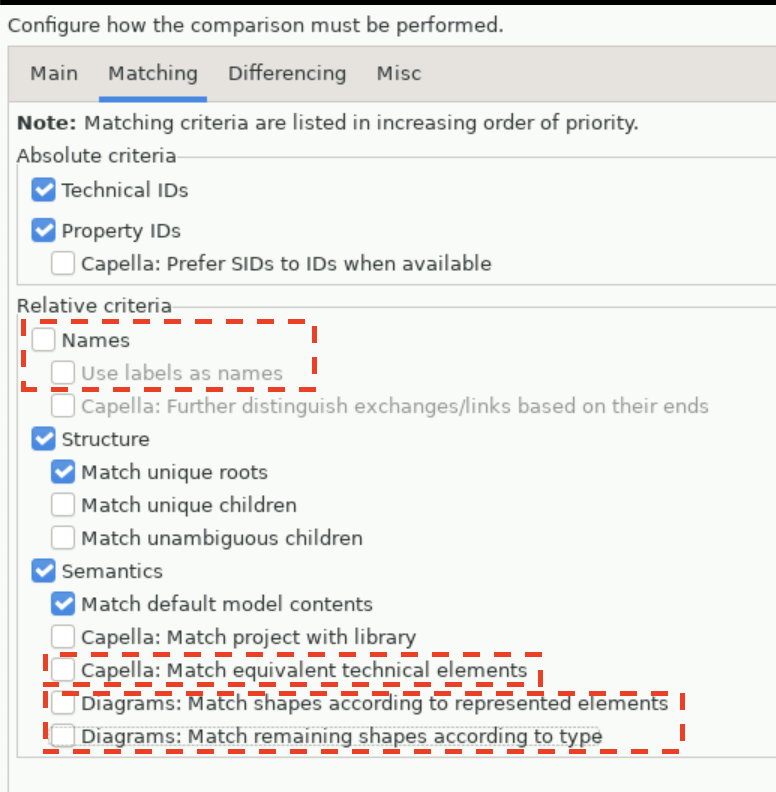
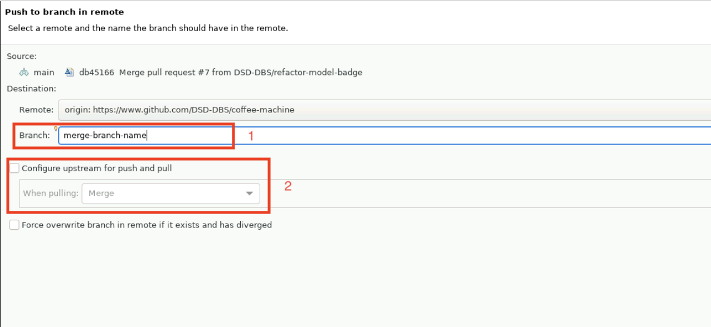

<!--
 ~ SPDX-FileCopyrightText: Copyright DB Netz AG and the capella-collab-manager contributors
 ~ SPDX-License-Identifier: Apache-2.0
 -->

# Working with Git

In this guide we explain how to use Git via Eclipse. When using Git we make
changes _locally_ and push them to a _remote_ (Gitlab or Github mainly)
repository. Here we explain how to get made changes to the remote repository so
that collegues can see and review them.

## Clone a Repository

First open the View _Git Repository_ by clicking on the magnifying glass (1) in
the right corner.


Searching looks like:


When clicking "Clone a Git repository" a view "Source Git Repository" to enter
the repository url opens. Enter here the URL of the _Remote_ of your repository
and if it is not a public repository enter your username and password. After
clicking "Next" the "Branch Selection" opens. Here you can pick a branch on
which you want to work. After clicking "Next" another time, the view "Local
Destination" opens. This shows where your work is going to be stored locally.

<!-- prettier-ignore -->
!!! info
    Tick the box: "Import all existing Eclipse projects after clone
    finishes" importing the cloned repository into your eclipse workspace


Then you can click finish. Your repository from the _Remote_ is now cloned
locally.

## Switch Branches

To collaborate it might be useful to work on different branches. Therefore,
there are two ways to switch branches (to checkout existing ones or to create a
new one).

Either you right click on the project name in the lower right corner, go to
"Switch to" and then e.g. "New Branch"


or you can right click on the project name in the project tree and then click
"Team"> "Switch to" > "New Branch".


In order to make the changes visible in your project tree and to see on which
branch you are currently working on right click on the project name > "Close
Project" and then open the project again.

## Prepare to Commit - Stage Changes

In Git staged changes are saved changes that we mark to use in our next commit.

In order to stage changes in Eclipse, open the View: _Git Staging_. In that
view you can see the staged and the unstaged changes (1). You can also see
changes that you made in the file tree on the left indicated by ">" (2). If
there are no (un-)staged changes you did not make a change compared to the last
state that Git already has saved in commits.



In the _Git Staging_ View mark the unstaged files that you want to stage and
drag them with your mouse to the "Staged Changes" area. Then reload (3) the
View in order to see the made changes.

## Commit and Push Changes

After having staged the changes they should be put into a commit. Therefore,
type a commit message to show what changes have been made. A commit message can
look like:

```
Short summary of the changes

Details of the made changes
Change #1
Change #2
```

Thus you and your collegues know what happened in the commit. Then commit the
changes (2).

<!-- prettier-ignore -->
!!! info
    The commit is now made locally. In order to publish it and share it with other you have to push it to the *Remote*!


If you already committed your changes you can right click on the Project >
"Team" > "Push to Origin" in order to push your changes to the remote.

If you have not commited yet and want to publish your changes and to share them
with your team rather click: "Commit and Push" (1). If you have not configured
that before you are now asked to "Configure upstream for push and pull" and the
selected default of "Merge" can just be kept. You might now be asked to enter a
user and a password for the remote repository in order to push your changes
there. Having done that you can click "Push".

Now your changes are saved at the remote repository where they are not lost and
your collegues can see them.

## Diff and Merge Models

<!-- prettier-ignore -->
!!! warning
    If you have to merge due to a merge conflict do not commit unless all conflicts highlighted are solved.

If the merge tool is not opening on its own due to a merge conflict you can
also diff two models on your own in order to check which changes were made.

Therefore, select both `.aird`-files (e.g. with control click). Then right
click on one of the files and select "Compare with" > "Each other as model".


In the image you can see the
[coffee machine model](https://github.com/DSD-DBS/coffee-machine) imported
twice with different changes made to each model in order to compare them.

In the View "Define the comparison operation to perform" it is important to
choose the **correct** order of which model is the source and which one is the
target. In that case we are taking the changes in the source to apply them to
the target, and are going to change the target model.

<!-- prettier-ignore -->
!!! warning
    Make sure to select the correct direction of merging in order to modify the
    correct model.


In the example we want to merge our changes from Left (coffee-machine model on
working branch) into Right (coffee machine model on main branch)(1).

Afterwards click "Configure" (2) to make further configurations.

Choose the option "Transfer of elements between models created independently".
Then click "Show advanced settings >>" to configure the matching process
between elements. Thus, click the now appeared tab "Matching".

Usually the UUIDs of the objects in your model should be stable. So ticking the
Absolute criteria "Technical IDs" and "Property IDs" should be sufficient.
Especially for if you know that there could be changes in diagrams you might
also want to tick "Diagrams: Match shapes according to represented elements"
and "Diagrams: Match remaining shapes according to type" as in Diagrams IDs
might change just by opening them. If nothing else helps choose "Names" and
click "Use labels as names" to match but labels easily change.



Afterwards, click "Ok" and "Finish".

Then you get into the merge view. Marked with the lock you can see which model
is going to be modified. They are also labeled as source and target where the
source is from which we are taking the changes and the target is the model that
gets modified.


The colors highlight what change was made and will be applied to the target if
you apply the change: _blue: create, red: delete, purple: modify_.

If there are any objects that are overarching you have to merge them seperately
as they can not be merged in the seperate layers.

### Merge Model Elements

In the synthesis view you can see the number of changes that happened. If you
click on a specific change you can see in the Details (1) and also marked in
blue on both models what changed and possibly how the current status in both
models is. Then you can right click on the change in the synthesis view and
click "Apply change(s)" (2) and you can click "Ok" then. Afterwards make sure
to Ctrl+S or File > Save to save the change made.

<!-- prettier-ignore -->
!!! warning
    If any of your changes depend on common objects independent of layers make sure
    to also apply those changes in order to create a working modification of the
    model.

If you have also changes in diagrams you should migrate them as well in the
same session.

### Merge Diagrams

Diagrams are stored in the `.aird` file. There the application of changes
happens similar. You can have a look into the multiple stages to see the what
exactly changed in the diagrams and you can very detailed choose the changes
that you want to apply.

If you have also changes in the model content you should merge both in the same
session.

## Merge Conflicts

Commit your changes as described above. Pull from the remote (e.g. right click
on the project > "Team" > "Pull"). This might result in merge conflicts which
you can solve via the merge tool.

### Merging with the Merge Tool

In the above description we made sure to decide which model is our target and
is going to be modified while the changes would be taken from the source model.
In the case of a merge conflict we have changes in both models at the same
position and it is not possible to automatically decide which change to keep
and which to overwrite because possibly both are reasonable changes. Thus you
as a user have to decide which changes to keep. In the following we are
describing how you can pick the changes that you later want to see in the
model.


With the butttons above the details of the made changes enable us to decide the
change from which model to take and which change to discard.

If the number of changes is overwhelming you can filter them by different
criteria (2). In the category "Three-way" you can tick "filtered" for the
changes that for the moment you prefer not to see and to tackle to apply the
changes one after another.

Make sure to resolve all conflicts before commiting! After merging reopen the
model and look especially into layouting as capella might be a bit
opportunistic in merging layouts.

### Merging if Merge Tool is not Possible

If merging with the merge tool is not possible you have to open the reset view.

{:style="width:500px"}

Then select hard reset of your local branch:


If you committed your changes earlier, and select your local main branch as
described, your local files will be reset to the state they were in after your
**last local commit**. This way, you drop the changes from the server locally,
but keep your changes. Removing the changes from the server in your local main
branch is not a problem, because they are still present in the remote main
branch on the git server.

You should now be able to see the project again with all changes, you
performed. Now you should push your local changes to a new branch. To do so,
right click on the project > "Team" > "Push branch 'main'...". In the view
"Push to branch in remote" you should enter an intermediate branch name like
“merge-branch-name” (1) and remove the “configure upstream push and pull” (2)
option.



After pushing your changes to the remote Git repository, open the remote
project on Gitlab or Github. Then open a Merge request (Gitlab) or Pull request
(Github) respectively and try merging your "merge-branch-name" branch into main
(or the branch you wanted to push on before).

You will now see whether the Merge request/ Pull request can be merged
automatically or not:

<!-- prettier-ignore -->
1. It can be merged automatically: Go for it and merge it. To continue working
   on the model, we recommend using a new clean session of Capella.
1. It can’t be merged automatically: You have now two options:
    1. Redo your work. We recommend using a new session for that.
    1. Open a service request or contact the operations team in order to try to
      get your changes merged manually.

In order to publish your changes and to share them with your team click:
"Commit and Push" (1). If you have not configured that before you are now asked
to "Configure upstream for push and pull" and the selected default of "Merge"
can just be kept. You might now be asked to enter a user and a password for the
remote repository in order to push your changes there. Having done that you can
click "Push".

Now your changes are saved at the remote repository where they are not lost and
your collegues can see them.
