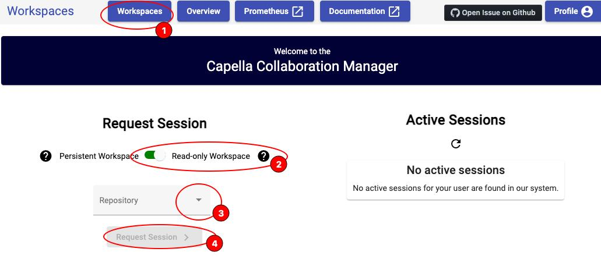

<!--
 ~ SPDX-FileCopyrightText: Copyright DB Netz AG and the capella-collab-manager contributors
 ~ SPDX-License-Identifier: Apache-2.0
 -->

 # Getting started with read-only project access

If you have a read-only project access or you simply want to check the model without risk of editing real you may start a read-only session.

Starting read-only session may take a bit of time, depending on the size of the model and depth of change history you requested.

During the start process the application will fetch the requested model and change history (if requested) from git and place it into an empty workspace. The read-only workspace only exists in RAM and has no real persistence / no changes will be saved even though it may look like so.
