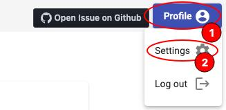
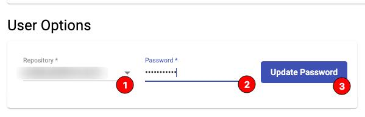
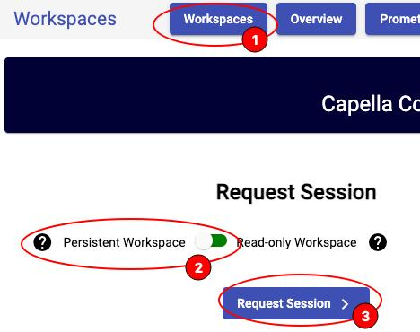
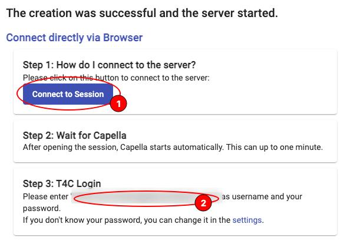
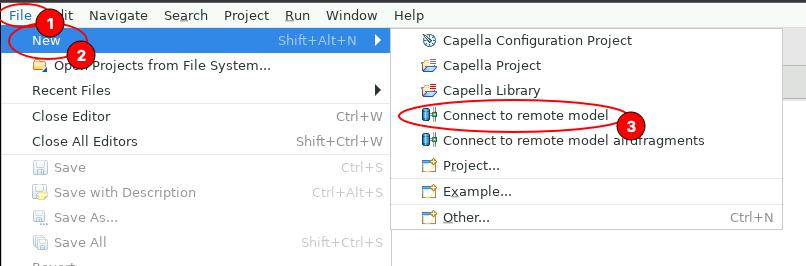

# Getting started with a TeamForCapella-based project

To get started with a TeamForCapella project you will first need to get read/write access from a Model Manager (usually this role is allocated to lead architects / area owners).

First step is to configure the repository-specific password. This is a TeamForCapella (application) password and it is only valid in scope of one specific project repository. You can set it by navigating to `profile -> settings`.

At the bottom of the Settings page you will see `User Options` heading followed by a repository selection drop-down. password field and `Update Password` button.

When the repository-specific password is set you can start a `Persistent Workspace Session` by navigating to `Workspaces`, toggling the session type selector and clicking `Request Session`.

Session spin-up may take up to 30 seconds, then the connection button will get enabled. When you click that button a new browser tab will open and you will see Capella loading. First time start may take up to 1 minute.

When Capella is finally loaded you may navigate to `File -> New -> Connect to remote model`.

In the drop down select the repository you would like to work with. In most cases the repository and project name should match.

Then you will need to click on `Test connection` and enter your repository-specific credentials that you defined in one of the previous steps.

The username in the `Test connection` dialog should be already pre-filled, however if this is not the case - you may need to fill it in manually.

When the connection test is completed successfully the `Next` button will be enabled - you should click that.

Then Project selection dialog should appear - the defaults are usually good here, just click `Finish`. This should result in the `project-name.team` being created in your workspace. You may now open the project, locate a file with `.aird` extension and double-click it to open the model in read-write mode.

