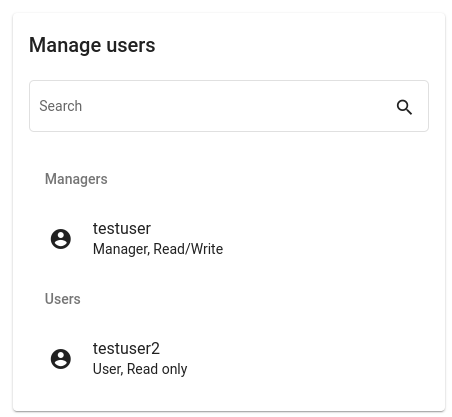

<!--
 ~ SPDX-FileCopyrightText: Copyright DB Netz AG and the capella-collab-manager contributors
 ~ SPDX-License-Identifier: Apache-2.0
 -->

!!! warning
    You need to be project lead for the specific project or adminstrator for the following steps

## Add user to project

1. Please select your project in the project overview.
2. On the right side you should now see user management options:
    
3. Please fill in the following fields:
      1. `Username`: Please ask your administrator if you are not sure which username to enter
      1. `Role` and `Permission`: Please have a look here for the overview of Roles and Permissions: [Project roles](../projects/roles.md)

        

## Modify role or permissions of user

1. Please select your project in the project overview.
1. On the right side you should now see user management options:
    
1. Please select the user you want do modify:
    

    You can select from the following options:

    - Remove a user from the project
    - Set role of the user to [project lead](../sessions/types.md) or [user](../sessions/types.md)
    - Set permission of the user to [read/write](../sessions/types.md) or [read-only](../sessions/types.md)

    !!! info
        You can not modify your own user or any administrator!

    !!! info
        Open sessions are not terminated automatically on permission change. The TeamForCapella access is only revoked when the user's last session is terminated.
