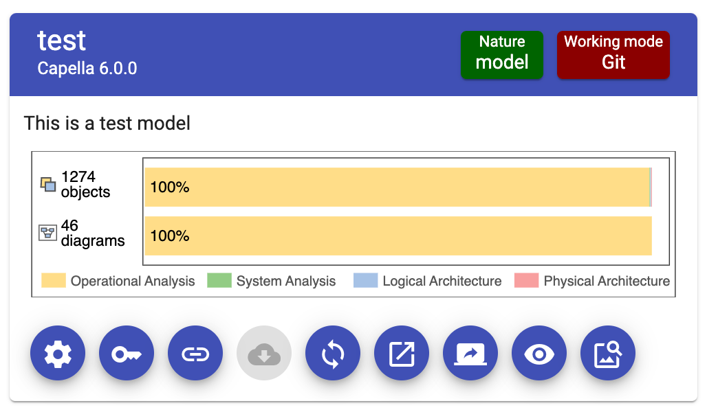

<!--
 ~ SPDX-FileCopyrightText: Copyright DB Netz AG and the capella-collab-manager contributors
 ~ SPDX-License-Identifier: Apache-2.0
 -->

# Model complexity badge integration

## Set up the complexity badge

!!! warning

    Please note the following limitations:

    - To setup the model complexity badge, you'll need a Git instance of type Gitlab. Other
      instances are not supported.
    - A file called `model-complexity-badge.svg` has to exist in the repository.
      We provide a Gitlab CI template to generate the file. Find more information below.
    - Only project leads can set up the model complexity badge. In addition, one needs access to the Gitlab repository of the model.

1. To set up the diagram cache, you need to add the Gitlab API URL to your
   Gitlab instance. More information
   [here](../../settings/model-sources/git.md)
1. Link a Gitlab repository to the model, for which you'd like to see the model
   complexity badge.
   <!-- prettier-ignore -->
    !!! info
         The model complexity badge integration uses the credentials, which are assigned during linking a Git repository.
         Limit the scopes of the used token, only scope `read_api` is required.

1. Follow the
   [Gitlab CI template instructions](https://github.com/DSD-DBS/py-capellambse/tree/master/ci-templates/gitlab#model-badge)
   to add the complexity badge pipeline to the `.gitlab-ci.yml` of the linked
   repository.

## View the model complexity badge

The model complexity badge is visible in the model overview in the project
details:

