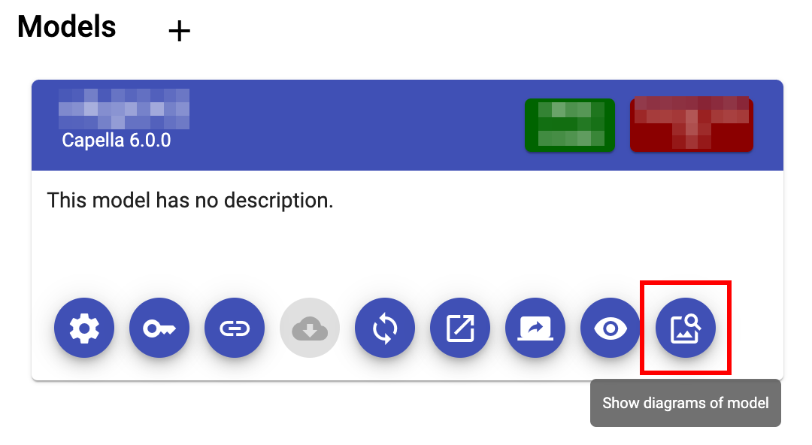

<!--
 ~ SPDX-FileCopyrightText: Copyright DB Netz AG and the capella-collab-manager contributors
 ~ SPDX-License-Identifier: Apache-2.0
 -->

# View diagrams via the diagram cache integration

1. Navigate to your project in the project overview.
2. In the model overview, select the diagrams button:
   
3. The diagram viewer should load and you should see all diagrams:
   
   <!-- prettier-ignore -->
    !!! note
        We'll search for a successful job run in the last 20 pipelines of
        the specific revision. If there is no successful pipeline or on Github your artifacts have expired, you won't be able
        to see diagrams.
4. If you want to enlarge a diagram, just click on the image preview.
