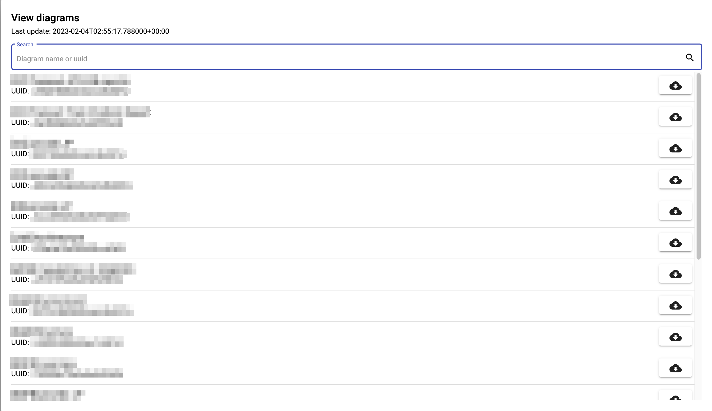

<!--
 ~ SPDX-FileCopyrightText: Copyright DB Netz AG and the capella-collab-manager contributors
 ~ SPDX-License-Identifier: Apache-2.0
 -->

[Full/ Technical Changelog](https://github.com/DSD-DBS/capella-collab-manager/releases)

# v2.16.0

- Github integration added: You can now get the capella diagram cache and model
  complexity badge from a Github repository. Therefore, the model complexity
  badge needs to be in the repository and the diagram cache in the artifacts of
  the respective branch in the repository.

# v2.13.0

- Pipeline runs have been added: You can now check the status and logs of the
  backup pipelines. Only works for manually triggered pipelines, the nightly
  pipelines will be added in a later release.
- Global monitoring dashboard for administrators. To identify possible failures
  and errors in projects and models, a global monitoring dashbaord was added.

# v2.12.0

- Redesign of the project members section for project leads: The list shows
  global administrators now. Action-buttons are available inline.
- Add support for mobile devices and smaller screens. This is handy if you want
  to manage project members, view the diagram cache or the model badge. If you
  really want to, you can actually run Capella or Papyrus on a smartphone.

# v2.11.0

- Redesign of the project detail page: The read-only sessions are moved from
  the models to the project overview.
- Documentation for the `pure::variants` integration was added

# v2.10.0

Adds a model complexity badge integration. Once set up, a model complexity
badge can be seen in the model overview. More information
[here](./projects/models/complexity_badge.md).

# v2.9.0

Improves the diagram viewer experience. When loading diagrams, one can now see
a small preview of matching diagrams. In addition, diagrams can be displayed
directly in the browser. To do so, just click on the diagram in the overview.
In addition, we improved the diagram loading error handling.

## v2.8.0

Add support for Jupyter notebooks.

## v2.7.0

Add integration for the diagram cache. The diagram cache integration allows
users to download diagrams from the browser. There is no need to spawn a
session, open the model, export the images and download the images - these
steps are just a few clicks now.

A short preview: 

More information:

- [How to set up the diagram cache integration?](./projects/models/diagrams/setup_diagram_cache.md)
- [How to view the diagrams?](./projects/models/diagrams/view_diagram_cache.md)

## v2.6.1

Add breadcrumbs for page navigation.

## v2.6.0

Restrict the number of read-only sessions. Users can no longer request the same
session twice.

## v2.5.2

No relevant changes.

## v2.5.1

No relevant changes.

## v2.5.0

The release adds a feature to delete projects. In addition, it adds better
logging capabilities with Grafana Loki.

## v2.4.0

Full support for pure::variants. More information
[here](./settings/tools/pure_variants.md)

## v2.3.0

We added features to control access and audit changes. When adding a user to
project, project managers have to provide a reason. In addition, we can detect
unused accounts. Also new: Users have to exist before they can be added to a
project. This prevents typos when adding users.

## v2.2.0

Starting with this release, users can select the checkout depth and
branches/tags for read-only sessions.

## v2.1.1

Add support for "unlinking" Git repositories from a model.

## v2.1.0

With this release, unused sessions (no cursor movement) will be terminated
automatically after a specific period of time (default 90 minutes). This helps
reducing cost and using the resources more efficiently. More information
[here](./sessions/request.md#automatic-session-termination).

In addition, one can now download files from personal workspaces in running
sessions.

The release also contains a feature to rename projects. Models of a project can
be deleted now.

## v2.0.2

No relevant changes.

## v2.0.1

No relevant changes.

## v2.0.0

With version 2.0.0 we create the basis for many new changes and a further
development of the platform. In general, you can view more details in the
corresponding sections of the documentation.

### General tool support

With the new version, we removed some dependencies from Capella. We can now
offer general tool and version support. This means that new tools like
[Papyrus](https://www.eclipse.org/papyrus/) can be easily integrated. Multiple
version support allows users to work on models with different versions. Before,
we had only support for one Capella version at a time.

### Projects as a new central resource

Projects are now in the center of the platform. Every user can create a new
project in a guided process and start working the preferred tools. This allows
the combination of different tools in one project and workflow. In addition, it
adds support for Capella libraries.

### TeamForCapella integration

The TeamForCapella integration has been reworked and has additional features.
Administrators can now add a TeamForCapella instance in the settings.
Repositories can be created with one click and we implemented additional error
handling.

### Improved stability for read-only sessions

Read-only sessions are much more stable and faster. In addition, they do
support multiple models (including libraries) and entrypoints now (you can load
a model from any subdirectory of the linked Git repository).

### Reworked backups

The backup flow has been reworked completely. Project Managers can now trigger
the backup with one click. More configuration options have been added: For each
run, it can be selected if the commit history should be included. Also, project
leads can create templates which can be used for manual triggering.
