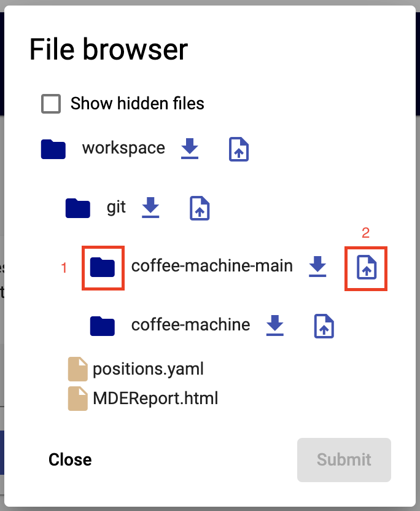

<!--
 ~ SPDX-FileCopyrightText: Copyright DB Netz AG and the capella-collab-manager contributors
 ~ SPDX-License-Identifier: Apache-2.0
 -->

# Upload

<!-- prettier-ignore-start -->

1. Navigate to `Workspaces`
1. On the right side, select the corresponding session. Select the persistent
   session to upload files into your persistent workspace. Click the
   `Upload button`:

    

1. Wait until the list of files has loaded.

   

    !!! hint
        To upload images into hidden directories, e.g., the workspace
        metadata, one has to expand these directories by clicking
        `Show hidden files`

1. Expand the directories until you find the directories where you want to
   upload your file to. Click the upload button next to the directory name.

   

1. Now, select the file(s) to upload and confirm. One can see the files to
   upload marked in green.

   

1. When you're ready and selected all files to upload, then confirm your
   selection with `Submit`
1. The upload can take a few seconds/minutes, depending on the file size.
1. When the upload was successful, the dialog closes without error message.

<!-- prettier-ignore-end -->

# Download

The documentation for the download feature will follow soon.
