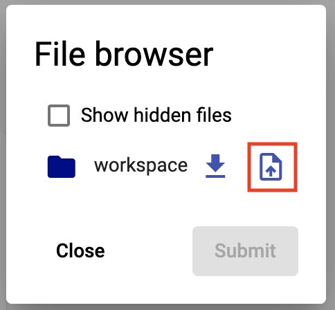
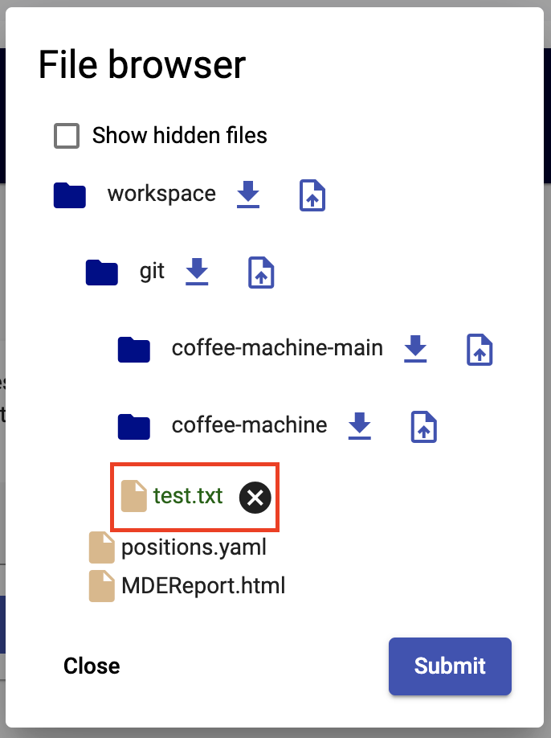

<!--
 ~ SPDX-FileCopyrightText: Copyright DB Netz AG and the capella-collab-manager contributors
 ~ SPDX-License-Identifier: Apache-2.0
 -->

# Browse, upload and download files

<!-- prettier-ignore-start -->

1. Navigate to the `Session` tab.
1. On the right side, select the corresponding session. Select the persistent
   session to upload files into your persistent workspace. Click the
   `File Browser`:

    

    {:style="width:300px"}

   

    !!! info
            It is currently only possible to upload files with a file size of less than 30MB.
            For larger files we recommend a data transfer via Git.

1. Expand the directories by clicking on the directory icon (1) until you find the directories where you want to
upload your file to. Click the upload button (2) next to the directory name.

          {:style="width:300px"}

      1. Now, select the file(s) to upload and confirm. The files to be uploaded are marked in green.

         

      1. When you're ready and selected all files to upload, confirm your
         selection with `Submit`.
      1. The upload can take a few seconds/minutes, depending on the file size.
      1. When the upload was successful, the dialog closes without error message.

=== "Download files"

   Documentation for "Download files" will follow soon.

<!-- prettier-ignore-end -->
