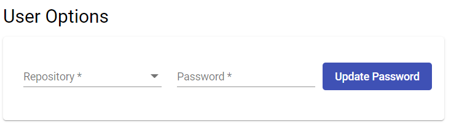
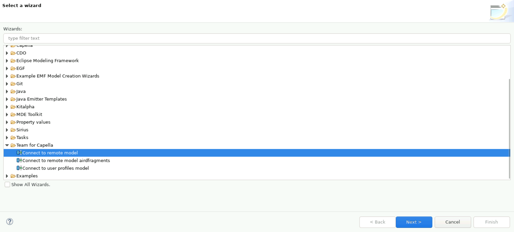
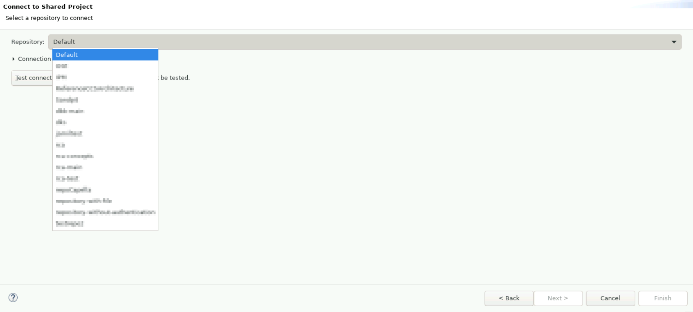
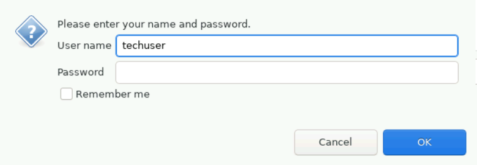

<!--
 ~ SPDX-FileCopyrightText: Copyright DB Netz AG and the capella-collab-manager contributors
 ~ SPDX-License-Identifier: Apache-2.0
 -->

---
title: TeamForCapella
---

!!! Info
    Please [request a session](../request.md) before you continue with the instructions here.

1. You have to set you own password for each TeamForCapella repository you have access to. Please navigate to <a href="/settings" target="_blank">Profile</a>. Here you should see the User settings section, where you can set your password:
    

2. Go back to your session
3. Click on `File` → `New` → `Other`:
    
4. Expand `Team for Capella` and select `Connect to remote model`:
    
5. Select your model from the dropdown list:

    !!! Question "Your model is missing?"
        Please have a look at [Project access](../../projects/access.md)

    
6. Click on `Test connection` and enter your personal credentials.

    !!! Question "What is my username?"
        You can find your username after your session was started.
        Alternatively, you can reopen the dialog when [Reconnecting](../reconnect.md)

    !!! Question "What is my password?"
        Please use the password you did set in step 1.

    !!! Bug
        Do not make use of the `Remember me` functionality. It requires you to enter another master password and is therefore useless.

    

7. Click `Ok` and `Finish`
8. The model should be loaded to your personal workspace.
