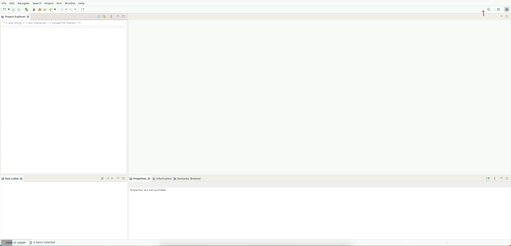
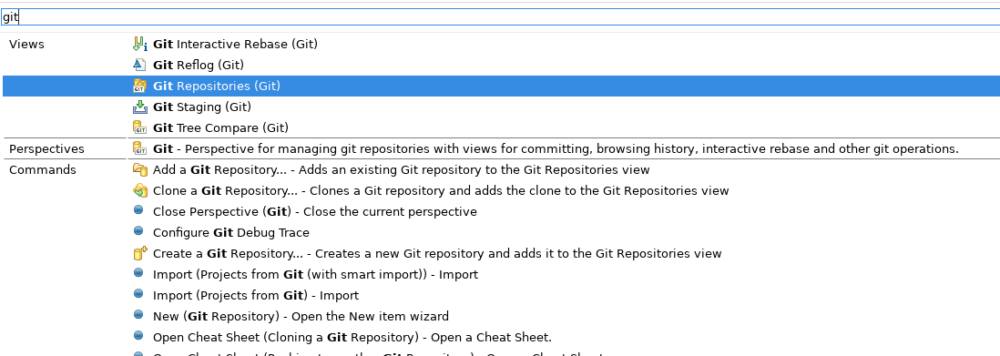
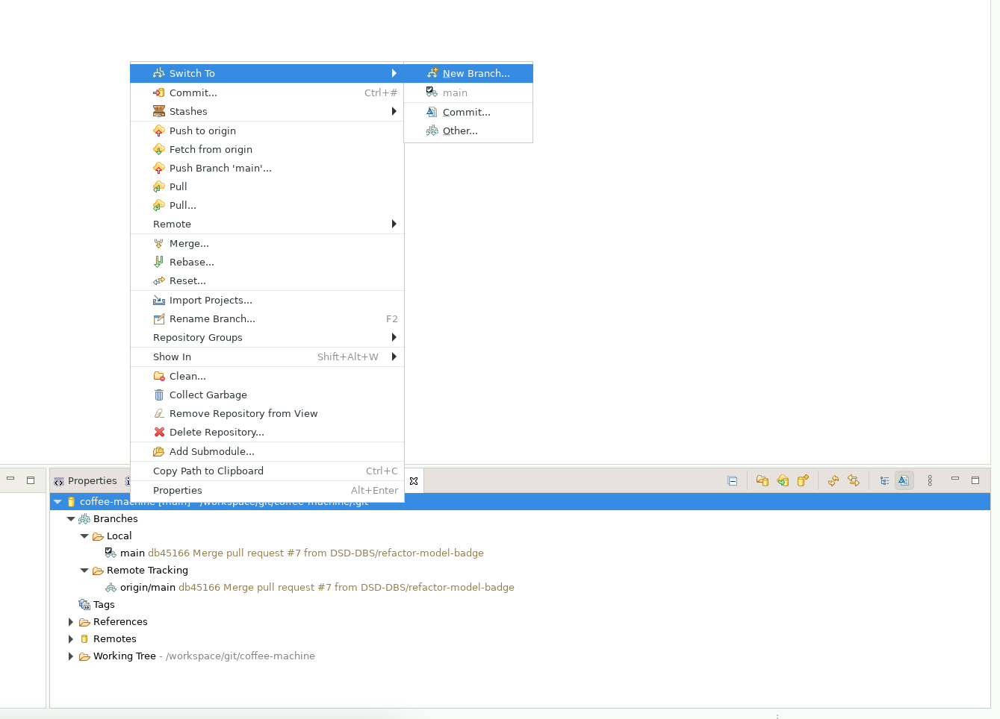
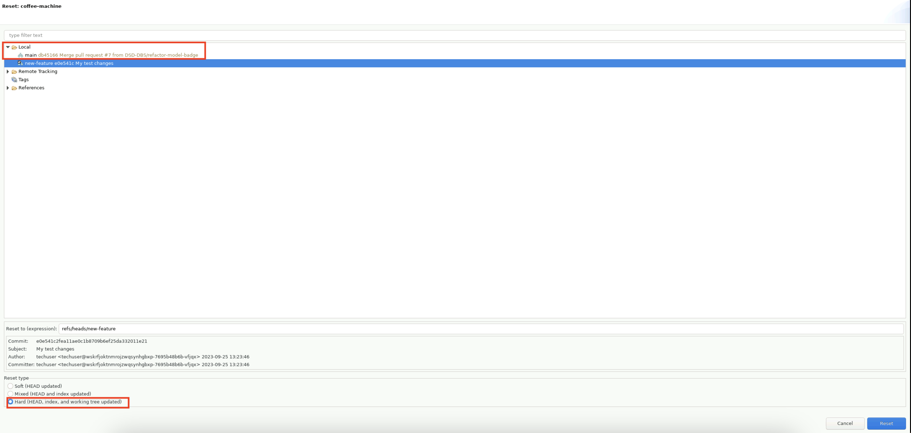

<!--
 ~ SPDX-FileCopyrightText: Copyright DB Netz AG and the capella-collab-manager contributors
 ~ SPDX-License-Identifier: Apache-2.0
 -->

# Working with Git

In this guide we explain how to use Git via Eclipse. When using Git we make
changes _locally_ and push them to a _remote_ (Gitlab or Github mainly)
repository. Here we explain how to get made changes to the remote repository so
that collegues can see and review them.

## Clone a Repository

First open the View _Git Repository_ by clicking on the magnifying glass (1) in
the right corner.



Searching looks like:



When clicking "Clone a Git repository" a view "Source Git Repository" to enter
the repository url opens. Enter here the URL of the _Remote_ of your repository
and if it is not a public repository enter your username and password. After
clicking "Next" the "Branch Selection" opens. Here you can pick a branch on
which you want to work. After clicking "Next" another time, the view "Local
Destination" opens. This shows where your work is going to be stored locally.

 <!-- prettier-ignore -->

    !!! info
        Tick the box: "Import all existing Eclipse projects after clone
        finishes" importing the cloned repository into your eclipse workspace


Then you can click finish. Your repository from the _Remote_ is now cloned
locally.

## Switch Branches

To collaborate it might be useful to work on different branches. Therefore,
there are two ways to switch branches (to checkout existing ones or to create a
new one).

Either you right click on the project name in the lower right corner, go to
"Switch to" and then e.g. "New Branch"



or you can right click on the project name in the project tree and then click
"Team"> "Switch to" > "New Branch".


In order to make the changes visible in your project tree and to see on which
branch you are currently working on right click on the project name > "Close
Project" and then open the project again.

## Prepare to Commit - Stage changes

In Git staged changes are saved changes that we mark to use in our next commit.

In order to stage changes in Eclipse, open the View: _Git Staging_. In that
view you can see the staged and the unstaged changes (1). You can also see
changes that you made in the file tree on the left indicated by ">" (2). If
there are no (un-)staged changes you did not make a change compared to the last
state that Git already has saved in commits.


In the _Git Staging_ View mark the unstaged files that you want to stage and
drag them with your mouse to the "Staged Changes" area. Then reload (3) the
View in order to see the made changes.

## Commit and Push Changes

After having staged the changes they should be put into a commit. Therefore,
type a commit message to show what changes have been made. A commit message can
look like:

```
Short summary of the changes

Details of the made changes
Change #1
Change #2
```

Thus you and your collegues know what happened in the commit. Then commit the
changes (2).

<!-- prettier-ignore -->
!!! info
    The commit is now made locally. In order to publish it and share it with other you have to push it to the *Remote*!


If you already committed your changes you can right click on the Project >
"Team" > "Push to Origin" in order to push your changes to the remote.

If you have not commited yet and want to publish your changes and to share them
with your team rather click: "Commit and Push" (1). If you have not configured
that before you are now asked to "Configure upstream for push and pull" and the
selected default of "Merge" can just be kept. You might now be asked to enter a
user and a password for the remote repository in order to push your changes
there. Having done that you can click "Push".

Now your changes are saved at the remote repository where they are not lost and
your collegues can see them.

## Merge Conflicts

Commit your changes as described above. Pull from the remote (e.g. right click
on the project > "Team" > "Pull"). This might result in merge conflicts which
you can solve via the merge tool.

If this is not the case you have to open the reset view.


Then select hard reset of your local branch:



If you committed your changes earlier, and select your local main branch as
described, your local files will be reset to the state they were in after your
**last local commit**. This way, you drop the changes from the server locally,
but keep your changes. Removing the changes from the server in your local main
branch is not a problem, because they are still present in the remote main
branch on the git server.

You should now be able to see the project again with all changes, you
performed. Now you should push your local changes to a new branch. To do so,
right click on the project > "Team" > "Push branch 'main'...". In the view
"Push to branch in remote" you should enter an intermediate branch name like
“merge-branch-name” (1) and remove the “configure upstream push and pull” (2)
option.


After pushing your changes to the remote Git repository, open the remote
project on Gitlab or Github. Then open a Merge request (Gitlab) or Pull request
(Github) respectively and try merging your "merge-branch-name" branch into main
(or the branch you wanted to push on before).

You will now see whether the Merge request/ Pull request can be merged
automatically or not:

<!-- prettier-ignore -->
1. It can be merged automatically: Go for it and merge it. To continue working
   on the model, we recommend using a new clean session of Capella.
1. It can’t be merged automatically: You have now two options:
    1. Redo your work. We recommend using a new session for that.
    1. Open a service request or contact the operations team in order to try to
      get your changes merged manually.
